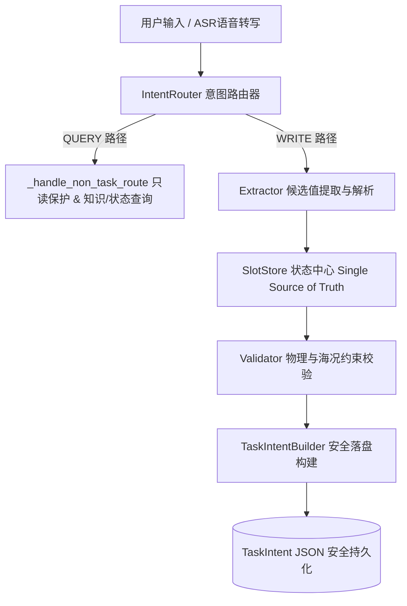

# SEAgent 1.0 (深海多 Agent 任务规划与 ASR 交互系统)

> 基于多 Agent 架构的深海作业任务规划、强约束对话管理与语音/文本多模态交互系统。

---

## 1. 项目解决的问题

深海水下机器人（ROV/AUV）作业具有海况复杂、设备层级繁多、物理物理限制（水深、载荷、机械臂能力）严苛的特点。传统交互系统容易遇到：
- **任务参数丢失与混淆**：多轮对话中用户补充或修改参数时容易导致已有槽位被误覆盖或混淆。
- **查询与写入不分**：用户询问设备能力或状态时，提取器误将提问词更新至任务状态。
- **静态历史替代动态遥测**：系统使用历史对话数据而非机器人实时遥测状态进行物理安全校验。
- **任务文件并发安全隐患**：任务落盘过程中由于并发覆盖、半写入或重名导致任务 JSON 损坏。

SEAgent 通过 **WRITE/QUERY 双通道路由**、**SlotStore 统一状态中心**、**实时遥测物理约束校验** 以及 **TaskIntent 排他锁原子持久化**，彻底解决上述痛点。

---

## 2. 当前核心能力

- **多模态自然语言交互**：支持文本输入与基于 Qwen ASR 的语音转写输入，结合领域词汇+上下文纠错与油田实体 Link 打分匹配。
- **LLM 语义权威路由（ADR-005）**：以 `InteractionPlan.operation` 为每轮路由的唯一权威字段，后端不根据关键词覆盖路由决策；低置信度写操作降级 CLARIFY，模型失效 fail-safe 澄清。
- **WRITE / QUERY 意图解耦**：精准区分写任务参数 (`WRITE`) 与读知识/状态 (`QUERY`)，确保查询交互绝对不污染任务状态。
- **SlotStore 状态中心**：提供 Single Source of Truth，支持全局版本自增、只读快照断言与事务回滚。
- **约束驱动机器人候选自动收敛（ADR-008）**：`get_feasible_robot_selection_domain()` 基于已确认 `water_depth`、`payload` 与即时遥测状态自动过滤候选树，执行"0 关闭 / 1 自动绑定 / 多等待消歧"三段决策。
- **设备候选与别名层级解析**：支持系列（Family）、型号（Variant）与单机（Unit）分层别名映射及 `canonical_exact` -> `alias_exact` -> `llm_semantic` 递进解析。
- **物理与海况强约束校验**：集成水深、海况、载荷及机器人在 `config/state.yaml` 中的实时遥测状态校验；约束失败直接阻断，不退化为追问。
- **TaskIntent 原子落盘保障**：基于 Staging 暂存区、跨进程排他锁 `TaskPublishLock` 与 `_atomic_commit_noreplace` 硬链接提交，确保任务文件全有或全无落盘。
- **快照恢复内存原子性（ADR-007）**：`load_snapshot()` 采用隔离候选管理器方案，恢复要么完整生效，要么完全不影响当前会话。

---

## 3. 简化系统架构图



---

## 4. 仓库主要目录说明

```
.
├── config/              # 业务与系统配置文件 (ASR, 资产, 物理约束, 地理环境, 机器人舰队, 状态)
├── docs/                # 正式项目文档体系 (架构总览, 开发测试指南, ADR 决策记录, 阶段进度报表)
│   ├── architecture/    # 系统架构设计文档
│   ├── decisions/       # 架构决策记录 (ADR)
│   ├── development/     # 开发与测试指南
│   └── progress/        # 阶段验证与缺陷跟踪报表
├── requirements/        # Python 依赖管理 (base.txt, test.txt, gpu.txt)
├── src/                 # 系统核心 Python 源码模块
│   ├── intent_router.py # WRITE/QUERY 路由控制
│   ├── slot_store.py    # 统一状态中心 SlotStore
│   ├── extractor.py     # 候选值提炼与三级解析
│   ├── validator.py     # 物理/海况限制校验
│   └── task_intent_builder.py # TaskIntent 排他锁与原子落盘
├── frontend/            # 前端交互 Web 资源 (index.html, js/, css/)
├── tests/               # 自动化单元测试与回归测试套件
├── run.py               # 系统主入口服务
├── web_backend.py       # Web 后端 API 服务
├── CONTRIBUTING.md      # 团队协作与贡献指南
└── CHANGELOG.md         # Keep a Changelog 格式演进历史
```

---

## 5. 快速开始与启动方式

### 5.1 环境准备与依赖安装

```bash
# 1. 安装 CPU 测试与基础依赖
pip install -r requirements/test.txt

# 2. （可选）若需运行本地 ASR 语音模型，安装 GPU 依赖
pip install -r requirements/gpu.txt
```

### 5.2 启动主服务

推荐使用离线模式启动服务：

```bash
TRANSFORMERS_OFFLINE=1 HF_HUB_OFFLINE=1 python run.py
```

服务启动后，可以通过浏览器访问 [frontend/index.html](file:///root/mzy/seagent1.0-main_asr/frontend/index.html) 或通过 API 接口进行交互。

---

## 6. 核心测试命令

在提交代码或发布前，必须在项目根目录运行以下测试验证：

```bash
# 1. Python 语法与编译检查
python -m compileall -q src tests

# 2. 全量测试套件（自动使用独立临时产物目录）
TRANSFORMERS_OFFLINE=1 HF_HUB_OFFLINE=1 python -m pytest -q
```

详细测试说明请参阅 [docs/development/testing.md](file:///root/mzy/seagent1.0-main_asr/docs/development/testing.md)。

---

## 7. 配置入口说明

所有核心参数定义集中在 `config/` 目录：
- [config/asr.yaml](file:///root/mzy/seagent1.0-main_asr/config/asr.yaml)：ASR 模型路径、语言及 `direct_to_llm` 模型直送开关。
- [config/robot_fleet.yaml](file:///root/mzy/seagent1.0-main_asr/config/robot_fleet.yaml)：ROV/AUV 舰队定义、物理参数、设备别名及 `status_ref` 映射。
- [config/constraints.yaml](file:///root/mzy/seagent1.0-main_asr/config/constraints.yaml)：物理约束规则限值与硬/软违规阈值。
- [config/oilfield.yaml](file:///root/mzy/seagent1.0-main_asr/config/oilfield.yaml)：海床地理边界、油田坐标定义及电子围栏。
- [config/state.yaml](file:///root/mzy/seagent1.0-main_asr/config/state.yaml)：机器人实时遥测状态与传感器健康度节点。

---

## 8. 文档导航

- 📘 **系统架构总览**：[docs/architecture/overview.md](file:///root/mzy/seagent1.0-main_asr/docs/architecture/overview.md)
- 🏛️ **治理基线**：[docs/architecture/governance-baseline.md](file:///root/mzy/seagent1.0-main_asr/docs/architecture/governance-baseline.md)
- 🛠️ **开发与测试指南**：[docs/development/testing.md](file:///root/mzy/seagent1.0-main_asr/docs/development/testing.md)
- 🤝 **团队贡献指南**：[CONTRIBUTING.md](file:///root/mzy/seagent1.0-main_asr/CONTRIBUTING.md)
- 🏛️ **架构决策记录 (ADR)**：
  - [ADR-001: WRITE/QUERY 双通道路由](file:///root/mzy/seagent1.0-main_asr/docs/decisions/ADR-001-write-query-routing.md)
  - [ADR-002: SlotStore 作为统一状态中心](file:///root/mzy/seagent1.0-main_asr/docs/decisions/ADR-002-slotstore-source-of-truth.md)
  - [ADR-003: TaskIntent 安全原子持久化](file:///root/mzy/seagent1.0-main_asr/docs/decisions/ADR-003-task-intent-atomic-persistence.md)
  - [ADR-004: 确定性任务请求守卫](file:///root/mzy/seagent1.0-main_asr/docs/decisions/ADR-004-deterministic-task-request-guard.md)
  - [ADR-005: LLM 语义权威](file:///root/mzy/seagent1.0-main_asr/docs/decisions/ADR-005-llm-semantic-authority.md)
  - [ADR-006: 双能力欢迎消息](file:///root/mzy/seagent1.0-main_asr/docs/decisions/ADR-006-two-capability-welcome-message.md)
  - [ADR-007: 快照恢复内存原子性](file:///root/mzy/seagent1.0-main_asr/docs/decisions/ADR-007-atomic-snapshot-restore.md)
  - [ADR-008: 约束驱动机器人候选收敛](file:///root/mzy/seagent1.0-main_asr/docs/decisions/ADR-008-constraint-aware-robot-selection.md)
- 📊 **阶段进展报表**：[docs/progress/phase-1-5-validation.md](file:///root/mzy/seagent1.0-main_asr/docs/progress/phase-1-5-validation.md)
- 📜 **版本演进日志**：[CHANGELOG.md](file:///root/mzy/seagent1.0-main_asr/CHANGELOG.md)

---

## 9. 当前项目状态与已知限制

- **状态**：Phase 2 阶段，LLM 语义权威路由（ADR-005）、约束驱动机器人候选收敛（ADR-008）与快照恢复内存原子性（ADR-007）已合并 main。核心架构闭环完成，CI 测试防线建立。
- **已知限制**：
  - 极度冷门或未录入别名表的设备俗称仍需依赖 LLM 语义解析，可能带来微小延时。
  - 遥测快照窗口为 24 小时；超时遥测数据阻断发布。
  - TaskIntent 原子落盘依靠底层硬链接 `os.link` 保证，若在跨网络挂载盘（如 NFS）运行需确保跨文件系统链接支持。
  - `burial_depth`、航程、续航过滤暂未接入约束驱动候选域（当前 schema 无对应任务字段）。
  - `ui_state_builder.py` 任务终态与会话交互终态过紧耦合（KD-01，待修复）。
