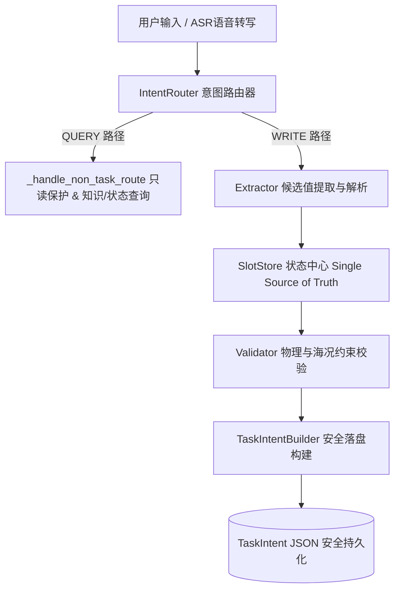

# SEAgent 1.0 (深海多 Agent 任务规划与 ASR 交互系统)

> 基于多 Agent 架构的深海作业任务规划、强约束对话管理与语音/文本多模态交互系统。

---

## 1. 项目解决的问题

深海水下机器人（ROV/AUV）作业具有海况复杂、设备层级繁多、物理限制（水深、载荷、机械臂能力）严苛的特点。传统交互系统容易遇到：
- **任务参数丢失与混淆**：多轮对话中用户补充或修改参数时容易导致已有槽位被误覆盖或混淆。
- **查询与写入不分**：用户询问设备能力或状态时，提取器误将提问词更新至任务状态。
- **静态历史替代动态遥测**：系统使用历史对话数据而非机器人实时遥测状态进行物理安全校验。
- **任务文件并发安全隐患**：任务落盘过程中由于并发覆盖、半写入或重名导致任务 JSON 损坏。

SEAgent 通过 **WRITE/QUERY 双通道路由**、**SlotStore 统一状态中心**、**实时遥测物理约束校验** 以及 **TaskIntent 排他锁原子持久化**，为上述问题提供状态隔离与发布保护。

---

## 2. 当前核心能力

当前支持管缆巡检、管缆埋设和采油树控制面板阀门插拔三类模板。拔出任务可归档，但当前 ROS 2 协议不支持拔出指令，执行派发会阻断；详见 [执行下发契约](docs/execution_dispatch_contract.md)。

- **多模态自然语言交互**：支持文本输入与基于 Qwen ASR 的语音转写输入，结合领域词汇+上下文纠错与油田实体 Link 打分匹配。
- **结构化语义路由（ADR-005）**：以 `InteractionPlan.operation` 组织路由，低置信度写操作和模型协议失败转入澄清；当前仍有候选别名、列表选择和固定任务启动表达触发的局部规则修正，详见 ADR-005 的实现差异说明。
- **WRITE / QUERY 意图解耦**：精准区分写任务参数 (`WRITE`) 与读知识/状态 (`QUERY`)，确保查询交互绝对不污染任务状态。
- **SlotStore 状态中心**：提供 Single Source of Truth，支持全局版本自增、只读快照断言与事务回滚。
- **机器人候选收敛（ADR-008）**：统一候选入口按任务能力筛选系列，交互收集阶段保留忙闲候选；非交互且任务在未来 60 分钟内开始时过滤不可用单机。水深、载荷和海床过滤尚未接入此入口，候选仍须经过后续业务校验。
- **设备候选与别名层级解析**：支持系列（Family）、型号（Variant）与单机（Unit）分层别名映射及 `canonical_exact` -> `alias_exact` -> `llm_semantic` 递进解析。
- **物理与海况强约束校验**：集成水深、海况、载荷及机器人在 `config/state.yaml` 中的实时遥测状态校验；约束失败直接阻断，不退化为追问。
- **TaskIntent 原子落盘保障**：基于 Staging 暂存区、跨进程排他锁 `TaskPublishLock` 与 `_atomic_commit_noreplace` 硬链接提交，确保任务文件全有或全无落盘。
- **快照恢复内存原子性（ADR-007）**：`load_snapshot()` 采用隔离候选管理器方案，恢复要么完整生效，要么完全不影响当前会话。

---

## 3. 简化系统架构图


```mermaid
graph TD
    UserInput[用户输入 / ASR语音转写] --> IntentRouter[IntentRouter 意图路由器]
    IntentRouter -->|QUERY 路径| KnowledgeQuery[_handle_non_task_route 只读保护 & 知识/状态查询]
    IntentRouter -->|WRITE 路径| Extractor[Extractor 候选值提取与解析]
    Extractor --> SlotStore[SlotStore 状态中心 Single Source of Truth]
    SlotStore --> Validator[Validator 物理与海况约束校验]
    Validator --> TaskIntentBuilder[TaskIntentBuilder 安全落盘构建]
    TaskIntentBuilder --> TaskIntentPersistence[(TaskIntent JSON 安全持久化)]
```

---

## 4. 仓库主要目录说明

```
.
├── config/              # 业务与系统配置文件 (ASR, 资产, 物理约束, 地理环境, 机器人舰队, 状态)
├── docs/                # 正式项目文档体系 (架构总览, 开发测试指南, ADR 决策记录, 阶段进度报表)
│   ├── architecture/    # 系统架构设计文档
│   ├── decisions/       # 架构决策记录 (ADR)
│   ├── development/     # 开发与测试指南
│   └── progress/        # 阶段验证与缺陷跟踪报表
├── requirements/        # Python 依赖管理 (base.txt, test.txt, gpu.txt)
├── src/                 # 系统核心 Python 源码模块（已完成 DDD 领域分层与内聚治理）
│   ├── asr/             # ASR 语音转写服务与领域专有名词纠偏
│   ├── temporal/        # 时间语义抽取、相对时间计算与时间范围引擎
│   ├── slots/           # 槽位存储 (SlotStore)、版本控制、候选仲裁与快照持久化
│   ├── validation/      # 规则引擎、空间范围校验、综合约束门禁与遥测安全
│   ├── dispatch/        # TaskIntent 构建、原子发布 (Staging/Lock)、派发与适配器
│   ├── extraction/      # NLU 槽位抽取、语义规范化、Prompt 模板与油田实体对齐
│   ├── session/         # 对话会话生命周期、影子跟踪、交互计划与意图路由
│   ├── handlers/        # DialogueManager 状态机各业务处理子模块
│   ├── knowledge/       # 油田知识图谱、设备层次图与本体查询引擎
│   ├── types/           # 核心数据结构与路由类型定义
│   ├── utils/           # 跨进程文件锁与通用辅助工具
│   ├── web/             # Web API 蓝图路由与 SSE 打字机流服务
│   ├── dialogue_manager.py # 对话总协调器门面 (HSM Facade)
│   ├── llm_client.py    # 大模型统一接口客户端
│   ├── knowledge_retriever.py # 知识库门面入口
│   └── constants.py     # 全局业务字段标签与常量单点真实源 (SSOT)
├── frontend/            # 前端交互 Web 资源 (index.html, js/, css/)
├── tests/               # 自动化单元测试与回归测试套件
├── run.py               # 系统主入口服务
├── web_backend.py       # Web 后端 API 服务
├── CONTRIBUTING.md      # 团队协作与贡献指南
└── CHANGELOG.md         # Keep a Changelog 格式演进历史
```

---

## 5. 快速开始与启动方式

### 5.1 环境准备与依赖安装

```bash
# 1. 安装 CPU 测试依赖，与普通 CI 对齐
python -m pip install torch --index-url https://download.pytorch.org/whl/cpu
python -m pip install -e '.[test]'

# 2. 真实模型环境需要 GPU 推理依赖；请使用独立环境
# python -m pip install -e '.[test,gpu]'
```

### 5.2 启动主服务

先选择运行模式：

```bash
# 无需下载或加载本地模型的接口/前端联调模式
OFFLINE_MOCK=1 ENABLE_MCP=0 python run.py

# 真实本地模型模式；需要 GPU extra 及本地 Qwen 模型目录
TRANSFORMERS_OFFLINE=1 HF_HUB_OFFLINE=1 \
LOCAL_MODEL_PATH=/path/to/Qwen3.5-9B \
python run.py
```

`run.py` 默认走真实模型模式，并从 `LOCAL_MODEL_PATH`、`SEAGENT_MODEL_DIR`
或 `/root/autodl-tmp/model/Qwen3.5-9B` 读取模型。没有本地模型或 GPU 依赖时，
请使用 `OFFLINE_MOCK=1`。

真实 ASR 还需安装提供 `qwen_asr.Qwen3ASRModel` 的运行包，并在
`config/asr.yaml` 中配置本地 ASR 模型路径。仓库的 GPU 依赖列表未包含该包；
ASR 加载失败时语音接口返回不可用。Mock 模式只用于接口和页面联调，不代表真实模型效果。

开发配置刷新默认关闭。仅在本机开发时，可添加 `SEAGENT_ENABLE_CODE_RELOAD=1`
启用自动检测和 `/api/dev/reload`；`DISABLE_HOT_RELOAD=1` 始终优先禁用自动刷新。
该入口支持 task_schemas、robot_fleet、assets、constraints、oilfield、state 的 YAML 配置。
Python 源码、模型和 ASR 等启动期配置变化会提示重启，不再局部替换 Python 模块。
ROS 2 运行配置的独立重载不受此开关影响。

服务启动后，在浏览器打开 [http://localhost:8890](http://localhost:8890) 使用对话页面，或打开 [监控页面](http://localhost:8890/dashboard)。页面需要由后端渲染，请通过服务地址访问；若设置了 `PORT`，将地址中的端口替换为对应值。

---

## 6. 核心测试命令

在提交代码或发布前，必须在项目根目录运行以下测试验证：

```bash
# 1. Python 语法与编译检查
python -m compileall -q src tests mcp/ros-mcp mcp/operation-time-window

# 2. 全量测试套件（自动使用独立临时产物目录）
TRANSFORMERS_OFFLINE=1 HF_HUB_OFFLINE=1 python -m pytest -q
```

详细测试说明请参阅 [docs/development/testing.md](docs/development/testing.md)。

---

## 7. 配置入口说明

所有核心参数定义集中在 `config/` 目录：
- [config/asr.yaml](config/asr.yaml)：ASR 模型路径、语言及 `direct_to_llm` 模型直送开关。
- [config/robot_fleet.yaml](config/robot_fleet.yaml)：ROV/AUV 舰队定义、物理参数、设备别名及 `status_ref` 映射。
- [config/constraints.yaml](config/constraints.yaml)：物理约束规则限值与硬/软违规阈值。
- [config/oilfield.yaml](config/oilfield.yaml)：海床地理边界、油田坐标定义及电子围栏。
- [config/state.yaml](config/state.yaml)：机器人实时遥测状态与传感器健康度节点。

---

## 8. 文档导航

- **完整文档索引与当前/历史边界**：[docs/README.md](docs/README.md)
- **当前设计契约**：[docs/current_design_contract.md](docs/current_design_contract.md)
- **任务归档与执行下发**：[docs/execution_dispatch_contract.md](docs/execution_dispatch_contract.md)

- 📘 **系统架构总览**：[docs/architecture/overview.md](docs/architecture/overview.md)
- 🏛️ **治理基线**：[docs/architecture/governance-baseline.md](docs/architecture/governance-baseline.md)
- 🛠️ **开发与测试指南**：[docs/development/testing.md](docs/development/testing.md)
- 🤝 **团队贡献指南**：[CONTRIBUTING.md](CONTRIBUTING.md)
- 🏛️ **架构决策记录 (ADR)**：
  - [ADR-001: WRITE/QUERY 双通道路由](docs/decisions/ADR-001-write-query-routing.md)
  - [ADR-002: SlotStore 作为统一状态中心](docs/decisions/ADR-002-slotstore-source-of-truth.md)
  - [ADR-003: TaskIntent 安全原子持久化](docs/decisions/ADR-003-task-intent-atomic-persistence.md)
  - [ADR-004: 确定性任务请求守卫](docs/decisions/ADR-004-deterministic-task-request-guard.md)
  - [ADR-005: LLM 语义权威](docs/decisions/ADR-005-llm-semantic-authority.md)
  - [ADR-006: 双能力欢迎消息](docs/decisions/ADR-006-two-capability-welcome-message.md)
  - [ADR-007: 快照恢复内存原子性](docs/decisions/ADR-007-atomic-snapshot-restore.md)
  - [ADR-008: 约束驱动机器人候选收敛](docs/decisions/ADR-008-constraint-aware-robot-selection.md)
  - [ADR-009: 测试与用户运行产物隔离](docs/decisions/ADR-009-test-runtime-artifact-isolation.md)
- 📊 **阶段进展报表**：[docs/progress/phase-1-5-validation.md](docs/progress/phase-1-5-validation.md)
- 📜 **版本演进日志**：[CHANGELOG.md](CHANGELOG.md)

---

## 9. 当前项目状态与已知限制

- **状态**：当前主流程包含普通对话、ASR、任务槽位收集、约束校验、TaskIntent 原子归档，以及可选的 ROS 2 MCP 派发；架构演进记录以 `CHANGELOG.md` 和 `docs/progress/` 中的最新报告为准。
- **已知限制**：
  - 极度冷门或未录入别名表的设备俗称仍需依赖 LLM 语义解析，可能带来微小延时。
  - 遥测规则 C019 当前为超过 30 分钟产生软警告；运行可用性门禁另有时效检查，不能以单一“24 小时窗口”概括，详见架构总览。
  - TaskIntent 原子落盘依靠 `os.link`；提交临时文件与正式文件必须位于同一支持硬链接的文件系统，网络挂载需单独验证。
  - 候选域尚未接入完整的型号约束过滤与软警告排序；`burial_depth`、航程和续航也没有对应的当前任务字段。详见 ADR-008。
  - `done` / `rejected` 任务保持任务字段只读，但允许继续进行只读对话；该行为由 `tests/test_issue_31_ui_state_contract.py` 覆盖。
