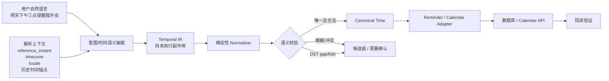
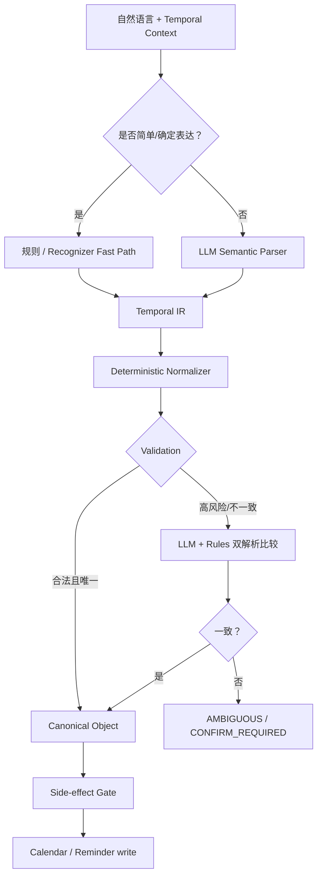

# 大模型厂商如何实现“时间的自然语言对话写入”：技术调研、代码风险审查与可执行改造方案

## 执行摘要

截至 **2026 年 8 月 25 日**，OpenAI、Google/DeepMind、Anthropic、Meta、Microsoft 等主流厂商公开的 API、模型格式与 Agent/Tool 文档呈现出一个非常一致的工程方向：**不会把“让大模型直接算出一个 UTC 时间戳并写数据库”作为可靠的生产级时间方案，而是把大模型放在“语义理解/工具参数生成”这一层，把真正的时间归一化、时区换算、夏令时处理、重复规则和最终写入交给应用程序的确定性代码。** OpenAI 和 Anthropic 提供严格 schema 的工具调用，Google Gemini 同时提供 Structured Output、Function Calling 和多轮状态，Meta 的 Llama 官方 prompt format 明确支持工具调用并在系统上下文中注入“Today Date”，Microsoft 则进一步提供了 `TimePlugin` 和 Recognizers-Text 这样的确定性时间组件。citeturn16search0turn18search0turn16search1turn16search5turn11search1turn17search1turn15search0

这意味着，“明天下午三点提醒我开会”真正应该经历的是：

> **自然语言 → 时间语义中间表示 → 确定性时区/日期归一化 → 歧义与 DST 校验 → 标准时间对象 → 日历/提醒写入**

而不是：

> **自然语言 → LLM 生成 `2026-08-26T07:00:00Z` → 直接写库**

两者最大的区别在于：**Structured Output 保证的是“JSON 长得对”，不保证“时间算得对”**。Google 的官方 Structured Output 文档甚至明确要求应用对 schema-compliant 的输出继续做语义校验；OpenAI 的 Structured Outputs/strict function calling 同样解决的是模式符合性问题。citeturn18search2turn18search0turn16search0

对于你的代码库，由于当前没有提供仓库路径、文件或实际错误样本，因此本报告无法声称已经定位到具体代码行。现阶段可以做的是**代码架构级风险审查和可直接实施的改造设计**。真正进行 repo-level audit 时，优先需要：

`时间解析代码 + LLM prompt/tool schema + reminder/calendar 写入层 + 数据库模型/迁移 + 用户 timezone/locale 获取逻辑 + recurrence/cron 代码 + 序列化代码 + 测试 + 依赖锁文件 + 匿名化错误样本`。

我的核心建议是建立一个独立的 **Temporal Intent Compiler（时间意图编译器）**，其核心原则是：

1. 每次解析都显式携带不可变的 `reference_instant + timezone_id + locale`；
2. LLM 输出**语义 IR**，而不是只输出最终 UTC timestamp；
3. 使用 **IANA 时区 ID**，绝不能仅存固定 UTC offset；
4. 单次事件保存 UTC instant，同时保留原始 local datetime 和 IANA timezone；
5. 重复事件以 **本地墙钟时间 + TZID + RFC 5545 RRULE** 为主语义，不能把无限重复提前压平成 UTC，也不应把 cron 当用户日历语义的唯一表示；citeturn17search2turn17search3
6. DST gap/fold、日期与星期冲突、“3点”“下周一”“月底”等情况必须进入语义校验，而不是静默猜测；
7. 中文常见表达用**规则/确定性解析器 + LLM 上下文理解**混合处理，不建议单押任何一个时间 NLP 库；
8. 所有真正执行的 `create/update reminder/event` 必须经过最后一层 deterministic validator。

按照“影响 / 难度”排序，最值得优先做的工作是：**先统一时间上下文和数据模型，再解决 DST/时区，然后把 LLM 和真实写入解耦，随后增加中文歧义层、重复事件、回归语料和监控。**

## 目标、时间语义边界与标准

所谓“时间的自然语言对话写入”，实际上不是一个单纯的 NLP 日期识别问题。它至少包含 **意图识别、时间表达抽取、时间锚定、时区解析、日历运算、区间运算、重复规则生成、对话继承和最终副作用执行**。

例如：

> 用户在 2026-08-25、时区 `Asia/Shanghai` 说：  
> “明天下午三点提醒我开会。”

“明天”不是一个绝对值。它必须相对于**收到这句话时的参考时间**解释。在上述上下文下，它应该形成：

```json
{
  "kind": "instant",
  "local_date": "2026-08-26",
  "local_time": "15:00:00",
  "timezone": "Asia/Shanghai"
}
```

经过时区解析后，对应的 UTC instant 才是：

```text
2026-08-26T07:00:00Z
```

关键点是，**`2026-08-26 15:00 Asia/Shanghai` 才是用户表达的原始语义；`07:00Z` 是它在时间轴上的投影。**

RFC 3339 定义的是互联网协议中的“时间点 timestamp”，要求时间具有明确 UTC 关系，并明确指出它**不覆盖时间区间**；RFC 也强调本地时区/DST 法规可能变化，数字 offset 比模糊的字母时区缩写更适合互操作。citeturn20view0 RFC 5545 iCalendar 则针对日历事件和重复规则定义了 `DTSTART`、`RRULE` 等语义，因此对“每周一上午 9 点”这一类表达，RRULE 比单一 RFC 3339 timestamp 更接近真实领域模型。citeturn17search2turn17search6

**必须区分的时间类型**如下：

| 类型 | 自然语言示例 | 推荐内部表示 |
|---|---|---|
| 绝对时间点 | “8 月 31 日上午 9 点” | LocalDateTime + TZID → Instant |
| 相对时间点 | “明天下午 3 点” | reference time + calendar operation |
| 持续时间 | “半小时后” | Duration |
| 时间区间 | “下周一 9 点到 11 点” | `[start, end)` |
| 日期 | “明天交报告” | LocalDate，不应强行变成午夜 UTC |
| 模糊时间 | “明早”“晚上”“月底” | range / fuzzy semantic + policy |
| 重复时间 | “每周一 9 点” | DTSTART + TZID + RRULE |
| 对话修改 | “改到下午 4 点” | previous temporal anchor + delta/override |
| 工作日时间 | “下个工作日早上” | calendar + holiday/business-day service |
| 非公历时间 | “农历八月十五” | calendar-system conversion，不能靠 Gregorian parser 硬猜 |

这里有几个尤其容易被低估的边界。

**“半小时后”和“明天这个时候”不是同一种运算。** 前者通常表示 elapsed duration，即时间轴上加 30 分钟；后者更接近 calendar arithmetic，即本地日历日期加一天、尽量维持墙钟时间。跨 DST 时，两者可能产生不同的真实经过时长。IANA 时区数据库会随着各国政治决策修改 UTC offset 和 DST 规则，因此不能用一个固定的 `-08:00` 代替 `America/Los_Angeles`。citeturn17search3turn17search7

**DST 会使一个合法格式的 local datetime 根本不存在，或者存在两次。** Python `zoneinfo` 官方文档用 `America/Los_Angeles` 的秋季回拨展示了同一个 `01:00` 可对应两个不同 offset，并通过 `fold=0/1` 区分。TC39 Temporal 同样显式设计了 `earlier / later / compatible / reject` 四种 disambiguation 策略。citeturn19search0turn19search1

因此，时间解析的正确心智模型应该是：



这也是我建议你代码库最终收敛的目标结构。

## 主流大模型厂商实现方式对比

公开资料并没有显示这些厂商在 API 内部开放了类似“GeminiTemporalParser”或“GPTDateParser”的专有确定性时间解析器。能够可靠从官方资料确认的是，厂商普遍公开的是**工具调用、结构化输出、上下文管理和应用侧执行边界**。因此下面的“时间实现方法”应该理解为**公开可复现的应用架构模式**，而不是对闭源模型内部算法的逆向猜测。

| 厂商 | 公开实现机制 | 相对时间/上下文 | 时区策略可获得的信息 | 自然语言 → 结构化时间 | 对你的系统最有价值的启示 |
|---|---|---|---|---|---|
| **OpenAI** | Function Calling + Structured Outputs；`strict:true` 约束工具参数 schema | Responses/对话历史可保留前文，因此可携带“刚才那个时间”“改到四点”等语境 | 官方工具机制本身不替应用决定用户 timezone，应由上下文/工具参数提供 | JSON Schema；Structured Outputs 支持 `date-time`、`date`、`time` 等格式 | LLM 负责语义 IR；strict schema 后仍必须做业务时间校验 |
| **Google / DeepMind** | Gemini Function Calling + Structured Output；Interactions API | `previous_interaction_id` 可在服务端连续维护历史 | 时区仍应作为应用上下文传入；工具执行在模型与应用之间形成明确边界 | JSON Schema，并支持 `format: date-time/date/time`；Gemini 3 可组合工具调用和 Structured Output | 适合多轮“改时间”；但 Google 官方明确要求继续做 semantic validation |
| **Anthropic** | Claude Tool Use，工具定义使用 JSON `input_schema`；支持 `strict:true` | Messages/tool lifecycle 支持多轮工具交互 | 应用执行 client tool，因此最终 timezone 和写入可完全由应用控制 | JSON Schema + strict tool use | 可利用详细 tool description / input examples 明确时间语义；不要把流式未完成参数直接执行 |
| **Meta** | Llama 官方 prompt format 支持 zero-shot function calling | 对话历史由推理框架维护 | Llama 官方 prompt 格式示例把 “Today Date” 放进 system context，说明当前日期必须成为显式 grounding | Tool-call 参数结构；实际 executor 在模型之外 | 自托管 Llama 尤其需要自己实现 context、normalizer 和 validator |
| **Microsoft** | Azure OpenAI Structured Outputs / Function Calling；Semantic Kernel / Agent Framework；Recognizers-Text | Agent/function layer 可维护上下文 | Semantic Kernel `TimePlugin` 明确提供 local now、UTC now、timezone name、offset | JSON Schema，同时有 Recognizers-Text 做 date/time recognition & resolution | 五家里公开组件最完整：LLM + 时间工具 + 确定性 NLP parser 很适合混合架构 |

OpenAI 的 Function Calling 文档明确推荐启用 `strict:true`；严格模式借助 Structured Outputs 使工具参数服从 schema，并要求关闭额外字段等约束。OpenAI 同时明确区分模型生成函数参数和**应用真正执行函数**这一边界。citeturn16search0turn18search0 这非常适合设计：

```json
{
  "action": "create_event",
  "temporal_expression": {
    "...": "semantic IR"
  }
}
```

而不应该设计成：

```json
{
  "action": "create_event",
  "timestamp": "模型自己猜的最终时间"
}
```

Google 当前推荐的新开发路径是 Gemini Interactions API；官方文档说明可以利用 `previous_interaction_id` 保留会话历史，而 `tools`、system instruction 等仍需要按 interaction 配置。Function Calling 与 Structured Output 也可组合使用。citeturn16search4turn16search1turn18search2 更关键的是 Google 官方 Structured Output 文档直接提醒：**结构合法不等于值的语义正确，最终结果应在应用代码中验证。** citeturn18search2

这其实是本问题最重要的厂商级共识之一。

Anthropic 的工具由 `input_schema` 定义，可以补充 `input_examples`，而 `strict:true` 能用于严格工具 schema；Claude 生成 `tool_use`，真正的 client-side 工具仍由应用执行。citeturn16search2turn16search5turn16search12 Anthropic 的 fine-grained tool streaming 还有一个值得时间写入系统特别警惕的细节：流式工具参数在完整结束前可能是**不完整甚至暂时无效的 JSON**，因此绝不能边流边执行“创建日程”这样的有副作用操作。citeturn16search16

Meta 的开放模型更能看出这条边界。Llama 官方仓库明确给出了 zero-shot function calling 格式，而工具本身由外部 executor 执行；Llama 3 系列官方 prompt format 还显式包含当前日期上下文，例如 `Today Date`。citeturn17search0turn17search4turn11search1 这说明一个很实用的原则：**不要期待模型“知道现在是什么时候”，应该显式注入解析基准。**

Microsoft 除 Azure Structured Outputs 之外还有一个值得特别借鉴的组件设计：Semantic Kernel 的 `TimePlugin` 明确暴露 `Now`、`UtcNow`、`Today`、`TimeZoneName`、`TimeZoneOffset` 等函数。citeturn17search1turn17search5 Microsoft Recognizers-Text 则专门做 numbers/date-time 等实体的 recognition + resolution，官方项目列出的完整支持语言包含中文。citeturn15search0 它体现的是很经典的混合路线：

> LLM 理解“用户想创建/修改什么”  
> + 确定性组件解析“这段文本对应什么时间”  
> + 应用程序决定最终怎么写。

但不要因此假定 Microsoft 的 parser 可以解决全部中文问题；其项目 issue 中有直接例子显示，“下个星期/下星期”等中文表达曾存在未识别问题。citeturn15search4 这正说明**任何规则库都需要用你的真实中文语料进行基准测试。**

由此可以把五家共同实践概括为四层：

**第一层：Grounding。** 给模型明确的“现在”、用户 timezone、locale 和会话时间锚点。

**第二层：Understanding。** LLM 负责把“那就改到周五下午吧”映射为结构化语义。

**第三层：Deterministic resolution。** 普通代码负责日期数学、IANA 时区、DST、区间和 recurrence。

**第四层：Execution。** 只有验证后的规范化时间对象才能进入 calendar/reminder API。

## 学术与开源时间解析工具对比

在 LLM 之前，Temporal Expression Recognition and Normalization 已经是成熟的 NLP 方向。传统代表系统如 HeidelTime、SUTime 通常把时间表达归一化到 TIMEX3；Duckling 更偏在线 NLU/结构化解析；Chronyk 则是轻量自然语言日期库。

| 工具 | 主要方法 | 相对时间/归一化 | 中文 | 优点 | 局限与建议 |
|---|---|---|---|---|---|
| **HeidelTime** | 手工规则 + domain-sensitive temporal tagging | TIMEX3；根据文档 domain 使用不同策略 | 有手工中文资源；另有大量自动生成语言资源 | 可解释、稳定、文档时间抽取成熟 | 更偏“文本时间标注”而非聊天动作写入；JVM/UIMA；需要评估许可证和部署成本 |
| **SUTime** | 确定性规则；基于 TokensRegex | 使用 reference time 归一化，例如 next Wednesday → concrete datetime；TIMEX3 | 官方内置规则主要英语 | 算法透明、强可重复性、方便新增规则 | 中文不是官方强项；Java/CoreNLP 依赖较重 |
| **Duckling** | regex/token predicates + composable production rules | Time/Duration 等维度输出结构化候选 | 有中文规则，但维度完整性因语言而异 | 快、可解释、非常适合 NLU fast path | Haskell 部署成本；中文复杂区间仍需补规则与回归 |
| **Chronyk** | 轻量 Python 解析 | yesterday、X hours ago 等 | 主要英语 | 极简单 | 时区表达是数字 offset 风格；版本和生态老，不建议作为新生产系统核心 |
| **Microsoft Recognizers-Text** | 语言规则 + recognition/resolution | DateTime resolution | 官方列中文为完整支持语言之一 | 多平台、MIT、确定性、与微软生态配合好 | 中文长尾表达仍有 issue，必须实际 benchmark |
| **dateparser / 类似现代库** | 多语言规则/locale parsing | 日期、相对日期等 | 通常较好 | Python 集成快，适合作 fallback | 不等于完整 interval/recurrence/dialogue temporal engine |
| **chrono-node** | JS 规则型自然语言日期 parser | today/tomorrow/range 等 | 非中文主力 | Web/Node 方便，range 支持实用 | 中文产品仍需额外 parser 或 LLM |

HeidelTime 官方项目明确把自己描述为 **multilingual, domain-sensitive temporal tagger**，从文档中抽取时间表达并归一化为 TIMEX3，同时包含手工中文资源；它的架构把 pattern、normalization data 和 rules 分离，因此很适合做可解释规则扩展。citeturn15search2turn15search6

SUTime 的定位同样非常清楚：它是一个 deterministic rule-based system，用 reference time 将类似 “next Wednesday at 3pm” 的表达映射成具体时间，同时输出 DATE、TIME、DURATION、SET 等 TIMEX3 类型。citeturn15search3turn15search10 其中 `SET` 对周期性时间表达尤其有启发——自然语言的重复时间本质上不是一个 timestamp。

Duckling 则更像工程型 NLU parsing engine。官方 README 明确表示规则由 **name + pattern + production** 组成；pattern 可以对字符 regex 或 token 概念进行匹配，production 将匹配结果生成新的语义 token。Time 维度可以输出带 grain 的归一化时间。citeturn15search1 它很适合做：

```text
简单可确定表达
    ↓
Duckling / 自研规则 fast path
    ↓
Temporal IR
```

但官方也明确说明不同语言并非支持所有维度，因此“支持中文”绝不能理解成“中文所有时间表达都正确”。citeturn15search1

Chronyk 的设计明显不适合承担现代时区系统核心职责：官方仓库示例主要使用 `timezone=0` 或以“秒数 offset”修改 timezone，其 setup 元数据仍面向早期 Python 3.x。citeturn19search2turn19search5 对只解析 “yesterday” 的小工具没问题，但对于 DST、IANA timezone、跨国日历和重复事件，建议直接排除。

综合来看，**你的系统不应该在“规则库”和“LLM”之间二选一。**

更合理的是：

```text
规则库擅长：
绝对日期、标准格式、数字、常见相对词、简单区间
→ 高确定性、低成本、可测试

LLM 擅长：
上下文继承、组合表达、口语、省略、意图、长句
→ “把刚才那个会改到下周一下午，然后提前半小时提醒”

IANA/日期库擅长：
UTC 转换、DST、calendar arithmetic
→ 不让语言模型自己算

RRULE/Calendar layer 擅长：
重复与例外
→ 不让 NLP parser 自己模拟调度器
```

## 代码库审查框架与常见错误模式

**当前审查状态：未提供代码库，因此不能定位具体 defect。** 以下清单是针对真实代码库最应该优先搜索的位置。

完整 repo audit 所需材料如下：

| 需要检查的内容 | 典型文件/关键词 | 要回答的问题 |
|---|---|---|
| 时间解析入口 | `date`, `time`, `temporal`, `parse_time` | relative expression 的基准是什么？ |
| LLM Prompt | system prompt、agent prompt | 是否给模型当前时间、timezone、locale？ |
| Tool schema | `create_event`, `reminder` | 模型是输出 IR，还是直接生成 timestamp？ |
| API/DTO | Pydantic/Zod/interface | timezone 是否可空？是否只有字符串？ |
| 数据库模型 | migrations/schema | 保存的是 UTC、local、offset 还是 tzid？ |
| 日历 Adapter | Google/Outlook/local calendar | all-day / interval / recurrence 是否正确映射？ |
| 用户 Profile | timezone/locale/device | timezone 来源和优先级是什么？ |
| 序列化 | JSON/ORM/protobuf | 是否丢 tzinfo 或 offset？ |
| Cron / scheduler | cron、queue、worker | recurring 是否被错误压成固定 UTC？ |
| 前端/mobile | Date/NSDate/Java time | device timezone 与 account timezone 是否混淆？ |
| Tests | fixtures/snapshots | 是否覆盖 DST、中文、跨年、重复事件？ |
| 部署环境 | `TZ`, Docker, tzdata | 本地与生产环境是否使用不同 tzdb？ |

实际错误日志最好至少提供几十条匿名样本，并保留：

```json
{
  "text": "那就改到明天下午四点",
  "received_at": "2026-08-25T02:01:23Z",
  "user_timezone": "Asia/Shanghai",
  "locale": "zh-CN",
  "previous_temporal_state": {},
  "actual_parser_output": {},
  "actual_written_value": {},
  "expected_value": {}
}
```

只有文本 `"明天下午四点"` 是不够的；**reference instant 和 timezone 本身就是输入的一部分。**

最常见的代码错误可以归纳为以下清单：

| 错误模式 | 典型错误实现 | 后果 | 严重性 |
|---|---|---|---|
| **使用 naive datetime** | `datetime(2026,8,26,15)` | 不知道 15 点属于哪个时区 | 极高 |
| **服务器时区充当用户时区** | `datetime.now()` | 海外用户“明天”错一天 | 极高 |
| **只保存 UTC offset** | `-08:00` | DST 后 offset 变化，未来事件错误 | 极高 |
| **LLM 直接写最终 timestamp** | tool arg 只有 `start_at` | 模型语义错误无法二次校验 | 极高 |
| **解析时不固定 reference time** | 每次调用 `now()` | retry 后“明天”可能变成另一日 | 极高 |
| **过早转 UTC** | recurrence 一开始转 UTC | “每周一 9 点”过 DST 后变 8/10 点 | 极高 |
| **DST gap 静默前移** | 02:30 → 03:30 | 用户实际时间被修改却不知情 | 高 |
| **DST fold 静默选一个** | 01:30 自动选首次 | 实际事件差一小时 | 高 |
| **all-day 存 midnight UTC** | `2026-08-26T00:00Z` | 换时区显示成前一天 | 高 |
| **秒/毫秒混用** | epoch seconds 当 ms | 时间偏几十年 | 高 |
| **丢掉 timezone 序列化** | aware → naive string | 回读无法恢复语义 | 高 |
| **“下周一”简单 +7 天** | `now + 7d` | 周定义错误 | 中高 |
| **区间解析成两个独立事件** | “2点到3点” → `[2,3]` | start/end 语义丢失 | 高 |
| **省略传播失败** | “下午2点到3点” → 14:00–03:00 | end < start | 高 |
| **“3点”强制 03:00 或 15:00** | 无 ambiguity state | 静默误排 | 中高 |
| **星期和日期冲突仍继续** | “9月3日周一” | 选错字段 | 高 |
| **月底硬编码 30 号** | `"月底" -> day=30` | 2 月、31 日月错误 | 中 |
| **每月 31 号手写 `+1 month`** | replace month | 缺少 31 日时崩溃/漂移 | 高 |
| **cron 代替日历 recurrence** | UTC cron | DST、例外和 COUNT/UNTIL 难表达 | 高 |
| **上下文只保留纯文本** | “改到四点”重新从零解析 | 不知道修改哪个时间对象 | 高 |
| **LLM confidence 当真概率** | `0.92 → 自动写` | 未校准概率造成误执行 | 中高 |

Python 官方文档明确指出 naive datetime 本身没有足够信息确定它相对于其他时间的位置。citeturn19search3 因此代码中出现以下类型值得直接做高危扫描：

```python
datetime.now()
datetime.utcnow()
datetime.strptime(...)
datetime.fromtimestamp(...)
dt.replace(tzinfo=...)
```

这些 API 不是天然错误，但如果周围没有明确的 timezone/reference semantics，就值得逐一审查。

**中文还应专门检查以下表达。**

“下周一”“这周一”“下个星期”“本周末”依赖 week policy；“下午 2 点到 3 点”需要把“下午”传播到区间结束；“3 点”可能是 03:00 或 15:00；“晚上”“明早”“月底”“近期”本质上不是精确 instant；“国庆后第一个工作日”需要假日日历；“农历八月十五”需要额外 calendar system；“北京时间”通常可以规范化为 `Asia/Shanghai`，而“美西时间”应谨慎处理，因为用户可能指 Pacific civil time，而不是永久固定的 PST offset。

还要特别测试类似：

```text
2026年9月3日周一上午9点
```

因为 **2026 年 9 月 3 日实际是星期四**。系统不应该悄悄相信“日期”或“周一”其中一个，而应返回：

```json
{
  "status": "AMBIGUOUS",
  "reason": "DATE_WEEKDAY_CONFLICT"
}
```

这类冗余字段冲突问题与 RFC 3339 对日期中加入 weekday 造成不一致风险的讨论本质相同。citeturn20view0

## 可执行修复方案、代码、测试与迁移

最重要的架构改造是增加一层**与模型厂商无关的 Temporal IR**。

推荐模型输出：

```json
{
  "action": "create_event",
  "source_text": "下周一上午9点到11点开项目会",
  "temporal": {
    "kind": "interval",
    "anchor": "reference_time",
    "local_date": "2026-08-31",
    "start_local_time": "09:00:00",
    "end_local_time": "11:00:00",
    "timezone_id": "Asia/Shanghai",
    "timezone_source": "profile",
    "precision": "minute",
    "recurrence": null,
    "ambiguities": []
  }
}
```

而不是：

```json
{
  "start": "2026-08-31T01:00:00Z",
  "end": "2026-08-31T03:00:00Z"
}
```

第二种格式把最重要的推理过程全部毁掉了：你无法再知道模型为什么认为是 8 月 31 日、为什么用了这个时区，也无法在 DST 或用户纠正时重算。

**每次调用的时间上下文建议固定成：**

```json
{
  "reference_instant": "2026-08-25T02:00:00Z",
  "reference_timezone": "Asia/Shanghai",
  "locale": "zh-CN",
  "week_start": "MONDAY",
  "user_preferences": {
    "default_event_duration_minutes": 60
  },
  "conversation_temporal_anchor": {
    "event_id": "evt_123",
    "start_local": "2026-08-26T15:00:00",
    "timezone_id": "Asia/Shanghai"
  }
}
```

特别重要的是 `reference_instant` 应该**在消息进入系统时冻结**，并沿 retry、fallback、模型切换一直传递。绝不能第一次模型调用用 23:59:58，重试时变成第二天 00:00:03，再重新解释“明天”。

建议解析优先级为：

```text
显式绝对日期 + 显式 IANA timezone
        ↓
绝对日期时间 + 明确城市/区域时区
        ↓
日期时间 + 用户 profile/device timezone
        ↓
相对时间 + 固定 reference instant
        ↓
对话修改 + previous temporal anchor
        ↓
模糊表达 / 冲突 / 不完整表达
        ↓
返回候选/确认状态，不直接产生副作用
```

对于“规则和模型谁优先”，不要简单设计成 LLM 永远先或规则永远先。更推荐风险分层：



对于高价值写入可以让**规则 parser 与 LLM 并行解析，然后比较**。例如：

```text
LLM:
2026-08-31 09:00 Asia/Shanghai

Recognizer:
2026-08-31 09:00 Asia/Shanghai

=> agreement → write
```

如果：

```text
LLM:
2026-08-31 09:00

Recognizer:
2026-08-24 09:00

=> disagreement → 禁止自动写
```

这样会增加部分计算成本，但可以只在“真正产生副作用”和复杂表达时启用。

**Canonical storage 建议如下。**

单次 event/reminder：

```text
start_at_utc       TIMESTAMP
end_at_utc         TIMESTAMP NULL
start_local        LOCAL DATETIME
end_local          LOCAL DATETIME NULL
timezone_id        VARCHAR  -- Asia/Shanghai
source_text        TEXT
resolution_version VARCHAR
```

重复事件：

```text
dtstart_local      2026-08-31T09:00:00
timezone_id        Asia/Shanghai
rrule              FREQ=WEEKLY;BYDAY=MO
exdates            [...]
```

不要只保存：

```text
start_at_utc = ...
utc_offset = +08:00
```

IANA tzdb 会根据政治决策更新时区边界、UTC offsets 和夏令时规则，所以 IANA zone ID 才能表达用户的 civil-time intent。citeturn17search3

RFC 5545 的 recurrence model 则适合表示用户日历语义。citeturn17search2 例如：

```text
DTSTART;TZID=Asia/Shanghai:20260831T090000
RRULE:FREQ=WEEKLY;BYDAY=MO
```

相比：

```cron
0 1 * * 1
```

前者表达的是：

> 每周一 **Asia/Shanghai 本地上午 9 点**。

后者本质上只是某个 scheduler 的执行规则，而且 timezone、例外、COUNT、UNTIL、改单次实例等领域语义很容易丢失。

**Python 示例：DST-safe 的本地时间解析。**

下面的实现只有标准库依赖，重点是证明“local datetime → instant”必须先检测 0/1/2 个合法候选。

```python
from __future__ import annotations

from dataclasses import dataclass
from datetime import datetime, timezone
from enum import Enum
from zoneinfo import ZoneInfo


class ResolutionStatus(str, Enum):
    VALID = "VALID"
    NONEXISTENT = "NONEXISTENT"
    AMBIGUOUS = "AMBIGUOUS"


@dataclass(frozen=True)
class InstantCandidate:
    local: datetime
    utc: datetime
    timezone_id: str
    fold: int


@dataclass(frozen=True)
class Resolution:
    status: ResolutionStatus
    candidates: tuple[InstantCandidate, ...]


def resolve_local_datetime(
    local_naive: datetime,
    timezone_id: str,
) -> Resolution:
    """
    将一个“墙钟本地时间”解析到真实时间轴。

    返回：
    - 0 个候选：DST gap / nonexistent local time
    - 1 个候选：正常时间
    - 2 个候选：DST fold / ambiguous local time
    """
    if local_naive.tzinfo is not None:
        raise ValueError("local_naive 必须是不带 tzinfo 的本地墙钟时间")

    tz = ZoneInfo(timezone_id)
    candidates: list[InstantCandidate] = []
    seen_utc: set[datetime] = set()

    for fold in (0, 1):
        aware = local_naive.replace(tzinfo=tz, fold=fold)
        utc_value = aware.astimezone(timezone.utc)

        # round-trip 是关键：
        # nonexistent local time 无法从 UTC 转换回来得到原输入。
        round_trip = utc_value.astimezone(tz).replace(tzinfo=None)

        if round_trip != local_naive:
            continue

        # 普通时间下 fold=0/1 通常对应同一个 instant，需要去重。
        if utc_value in seen_utc:
            continue

        seen_utc.add(utc_value)
        candidates.append(
            InstantCandidate(
                local=aware,
                utc=utc_value,
                timezone_id=timezone_id,
                fold=fold,
            )
        )

    if not candidates:
        return Resolution(
            status=ResolutionStatus.NONEXISTENT,
            candidates=(),
        )

    if len(candidates) == 2:
        return Resolution(
            status=ResolutionStatus.AMBIGUOUS,
            candidates=tuple(candidates),
        )

    return Resolution(
        status=ResolutionStatus.VALID,
        candidates=tuple(candidates),
    )
```

Python 官方 `zoneinfo` 的 `fold` 就是为了表示 DST 回拨造成的重复时间；这一思路与 TC39 Temporal 对 `earlier/later/reject` 的显式 disambiguation 一致。citeturn19search0turn19search1

业务层应该是：

```python
def require_unambiguous_time(
    local_naive: datetime,
    timezone_id: str,
) -> InstantCandidate:
    resolution = resolve_local_datetime(local_naive, timezone_id)

    if resolution.status == ResolutionStatus.NONEXISTENT:
        raise ValueError(
            "NONEXISTENT_LOCAL_TIME: "
            "该本地时间可能落在夏令时跳过区间"
        )

    if resolution.status == ResolutionStatus.AMBIGUOUS:
        raise ValueError(
            "AMBIGUOUS_LOCAL_TIME: "
            "该本地时间对应两个真实时刻，需要 disambiguation policy"
        )

    return resolution.candidates[0]
```

对于提醒/日程这种用户可见副作用，我更推荐默认策略：

```text
normal                   → 自动继续
DST gap                  → reject / 需要确认
DST fold                 → reject / 需要确认
显式带 offset 的输入      → 验证 offset 和 timezone 是否一致
```

而不是 Temporal 默认的 `compatible` 静默修复，因为“自动帮用户把 02:30 改成 03:30”在日程领域很难被认为是安全语义。TC39 Temporal 提供 `reject` 正说明这种策略应该由应用明确决定。citeturn19search1

**建议建立如下黄金测试集。**

假设默认：

```text
reference_instant = 2026-08-25T02:00:00Z
timezone          = Asia/Shanghai
local reference   = 2026-08-25 10:00
locale            = zh-CN
week_start        = MONDAY
```

| 输入 | 期望语义 | 期望规范化 |
|---|---|---|
| 明天下午三点提醒我开会 | instant | `2026-08-26T15:00+08:00` / `07:00Z` |
| 下周一上午9点到11点 | interval | `2026-08-31 09:00–11:00 Asia/Shanghai` |
| 今晚8点 | instant | `2026-08-25 20:00 +08` |
| 半小时后 | elapsed duration | reference instant + PT30M |
| 明天这个时候 | calendar relative | local date + 1 day |
| 这个月最后一天17点 | instant | `2026-08-31 17:00 +08` |
| 明天下午2点到3点 | interval | `14:00–15:00`，下午语义传播 |
| 明天9点到8点 | invalid/ambiguous | 禁止静默生成倒置区间 |
| 3点提醒我 | ambiguous | `AMBIGUOUS_MERIDIEM` |
| 2026年9月3日周一9点 | conflicting | `DATE_WEEKDAY_CONFLICT` |
| 每周一上午9点 | recurrence | `FREQ=WEEKLY;BYDAY=MO` |
| 每月31号9点 | recurrence + policy | 明确缺少31号月份的行为 |
| 明天提醒我交报告 | date-only / incomplete | 不强行假设 00:00 |
| 北京时间明天9点 | explicit timezone | `Asia/Shanghai` |
| 美西时间明天9点 | timezone semantic | 解析为 region zone，而非永久 `-08:00` |
| 那就改到下午4点 | conversational override | 继承前一 event 日期和 timezone |
| 再推迟半小时 | conversational delta | 对前一已确认时间 + PT30M |
| 2020-03-08 02:30 America/Los_Angeles | DST gap | `NONEXISTENT` |
| 2020-11-01 01:30 America/Los_Angeles | DST fold | `AMBIGUOUS`, 两个 instant |
| 03/04 下午3点 | locale ambiguity | 不依赖隐式美式/欧式日期格式 |

Python 官方文档直接使用 2020 年 11 月 1 日 Los Angeles 的 `01:00` 展示两个不同 offset，因此这个 DST fold 是很好的永久回归样本。citeturn19search0 RFC 3339 也专门指出类似 `10/11/1996` 的本地日期格式不适合全球互操作，因为不同地区解释不同。citeturn20view0

**模型 schema 本身也需要改。**

推荐：

```json
{
  "type": "object",
  "additionalProperties": false,
  "properties": {
    "kind": {
      "type": "string",
      "enum": [
        "instant",
        "interval",
        "date",
        "duration",
        "recurrence"
      ]
    },
    "source_text": {
      "type": "string"
    },
    "local_date": {
      "type": ["string", "null"],
      "format": "date"
    },
    "local_time": {
      "type": ["string", "null"],
      "format": "time"
    },
    "end_local_date": {
      "type": ["string", "null"],
      "format": "date"
    },
    "end_local_time": {
      "type": ["string", "null"],
      "format": "time"
    },
    "timezone_id": {
      "type": ["string", "null"]
    },
    "timezone_source": {
      "type": "string",
      "enum": [
        "explicit",
        "profile",
        "device",
        "conversation",
        "unknown"
      ]
    },
    "needs_confirmation": {
      "type": "boolean"
    },
    "ambiguity_code": {
      "type": [
        "string",
        "null"
      ]
    }
  },
  "required": [
    "kind",
    "source_text",
    "local_date",
    "local_time",
    "end_local_date",
    "end_local_time",
    "timezone_id",
    "timezone_source",
    "needs_confirmation",
    "ambiguity_code"
  ]
}
```

OpenAI strict function calling 要求对象 schema 对额外字段和 required 字段进行严格约束，因此这种 IR 也天然适合 OpenAI 的工具接口。citeturn16search0 Google、Anthropic 也支持 JSON-schema 型 structured/tool output。citeturn18search2turn16search5

注意：字段名叫 `timezone_id` 而不是：

```text
timezone_offset
```

也不要只让模型输出：

```text
PST
CST
IST
```

缩写在全球语境中可能有多义性，而且 RFC 3339 也指出字母形式 local offset 在互操作历史上存在问题。citeturn20view0

**优先修复顺序如下。**

| 优先级 | 修复 | 影响 | 难度 | 原因 |
|---|---|---:|---:|---|
| **P0** | 所有解析显式传 `reference_instant + timezone_id + locale` | 极高 | 低 | 一次解决大量“明天/今天”漂移 |
| **P0** | 禁止 naive datetime 进入持久化/写入边界 | 极高 | 中 | 防止服务器/用户时区混淆 |
| **P0** | 创建统一 Temporal IR | 极高 | 中 | 把 LLM 与时间运算解耦 |
| **P0** | 所有写操作进入 deterministic validator | 极高 | 中 | schema 正确不等于时间语义正确 |
| **P0** | IANA timezone + tzdata | 极高 | 中 | 解决 DST 与未来规则变化 |
| **P1** | DST gap/fold 检测 | 高 | 中 | 避免静默错一小时 |
| **P1** | recurrence 改为 wall-clock + TZID + RRULE | 极高 | 中高 | 解决周期任务 DST 漂移 |
| **P1** | conversation temporal state | 高 | 中 | 支持“改到4点/再推半小时” |
| **P1** | 中文区间/相对日期规则层 | 高 | 中 | LLM 外建立确定性保障 |
| **P2** | 模糊时间和歧义策略 | 高 | 中高 | “3点/晚上/月底”等不能硬猜 |
| **P2** | 规则 parser 与 LLM disagreement check | 高 | 中 | 高风险动作增加一道防线 |
| **P2** | golden corpus + provider/version regression | 极高 | 中 | 防止模型升级产生时间回归 |
| **P3** | fast-path routing/caching | 中 | 中 | 在正确性稳定后优化成本延迟 |

**推荐依赖组合**因技术栈而异。

Python：

```text
stdlib datetime
+ zoneinfo
+ tzdata（跨平台部署时建议明确依赖）
+ dateparser 或 Microsoft Recognizers-Text（候选）
+ 自研 zh-CN temporal rules
+ LLM structured output
+ RRULE/iCalendar library
```

Python `zoneinfo` 是标准库对 IANA 时区数据库的支持，并且可以依赖系统数据或 `tzdata` 数据包。citeturn19search0

JavaScript/TypeScript：

```text
Temporal / Temporal polyfill
+ chrono-node 或自研 parser
+ zh-CN rules / service parser
+ LLM structured output
+ RRULE library
```

TC39 Temporal 的 `ZonedDateTime` 明确把 exact time、wall-clock datetime 和 timezone 关联在一起，并且对 DST 冲突提供显式策略，因此比在新系统中继续大规模堆叠 legacy `Date` 更适合作为时间领域模型。citeturn19search1turn19search9

**迁移建议不要一次重写全部。**

第一阶段先建立 `TemporalContext` 和一个统一 normalization gateway，让所有旧 parser 的结果先经过它：

```text
Old parser
    ↓
Legacy Adapter
    ↓
Temporal IR
    ↓
Validator
```

第二阶段给数据库增加 `timezone_id / local_datetime / source_text / parser_version` 等字段，采用 dual-write：

```text
old timestamp columns
+
new canonical temporal columns
```

第三阶段对同一请求同时执行：

```text
旧逻辑 → shadow result
新逻辑 → shadow result
```

但只让旧逻辑真正写入，通过日志比较两者。

第四阶段在 golden corpus 达标后，让新 pipeline 对低风险场景实际写入。

第五阶段将复杂/歧义场景迁移。

最后才移除旧 parser 和兼容字段。

这种方式比“换一个更强模型然后直接上线”可靠得多，因为时间 bug 通常不是模型单一能力问题，而是**reference、timezone、storage 和 recurrence 语义没有被系统显式建模**。

## 验证、监控、性能与最终建议

时间系统上线后不能只监控：

```text
HTTP 200 rate
```

因为最危险的时间 bug 往往是：

```text
请求成功
日历创建成功
但是创建在错误的时间
```

推荐至少记录以下指标：

| 指标 | 目的 |
|---|---|
| `temporal_schema_valid_rate` | LLM 结构合法率 |
| `temporal_semantic_valid_rate` | 通过确定性业务校验的比例 |
| `temporal_parse_success_rate` | 最终可解析比例 |
| `temporal_ambiguity_rate` | 模糊/歧义表达比例 |
| `temporal_confirmation_rate` | 需要确认比例 |
| `temporal_rule_llm_disagreement_rate` | 规则与模型不一致率 |
| `timezone_explicit_rate` | 用户明确给 timezone 的比例 |
| `timezone_default_fallback_rate` | 使用默认 timezone 的比例 |
| `dst_gap_detected_count` | nonexistent local time 发现量 |
| `dst_fold_detected_count` | ambiguous local time 发现量 |
| `interval_invalid_rate` | end ≤ start 等错误 |
| `recurrence_validation_failure_rate` | RRULE/重复规则错误 |
| `calendar_write_failure_rate` | downstream 写入失败 |
| `post_write_edit_rate` | 用户短时间内立刻修改时间的比例 |
| `post_write_delete_rate` | 创建后快速删除，可作为错写 proxy |
| `parser_fallback_rate` | fast parser → LLM/fallback 比例 |
| `p50/p95_temporal_parse_latency` | 解析延迟 |
| `p50/p95_normalization_latency` | 确定性归一化延迟 |
| `model/provider/version` | 关联模型升级和回归 |
| `tzdb_version` | 关联时区数据库更新和变化 |

其中尤其值得重视：

> **创建后几分钟内用户主动修改时间的比例。**

它往往比单纯的 parser exception 更能反映真实时间错误。

测试至少分四层。

**单元测试**测试日期运算、zone conversion、DST gap/fold、interval、RRULE。

**语义 golden test**固定：

```text
utterance
reference_instant
timezone
locale
conversation state
expected Temporal IR
expected canonical result
```

然后每次升级 prompt、模型、parser、timezone 库都跑整套。

**provider regression**要分别记录模型：

```text
openai/model-version
gemini/model-version
claude/model-version
llama/checkpoint
```

因为 Structured Output schema 不变并不意味着模型对“下周一”之类语义的解释永远不发生行为变化。

**端到端测试**不能停在模型返回 JSON，而必须验证：

```text
输入自然语言
→ parser
→ normalizer
→ DB/calendar write
→ read back
→ 转回用户 timezone
→ 与期望 wall-clock time 比较
```

性能方面，不建议每一句都机械地调用最昂贵模型。

生产上可以设计三条路径：

```text
简单：
“明天3点”
→ deterministic parser / small model
→ validator

复杂：
“等我周四下午开完那个会之后半小时提醒我”
→ LLM
→ Temporal IR
→ validator

高风险：
“每月最后一个工作日下午5点，美西时间”
→ LLM + rule/business calendar
→ cross-check
→ validator
```

规则型时间解析的优势不是“它永远比 LLM 准”，而是**行为可重复、错误可以通过测试固定下来、升级不会随机改变语义**。LLM 的优势则在复杂上下文、口语省略和组合推理。因此最优路线不是替换关系，而是职责划分。

对固定的 tool/schema 也应尽量避免每次动态生成完全不同的结构。OpenAI 的 function/structured schema 机制以及 Anthropic 的 schema/grammar 类机制都存在 schema 处理与缓存相关的工程考量；稳定 schema 更适合生产调用。citeturn16search0turn16search2

最终建议的生产架构可以压缩为一句话：

> **让大模型“解释用户说的是什么时间”，让确定性时间引擎“决定这个语义在时间轴上到底是哪一个时刻”，让 validator“决定能不能执行”，最后才让 calendar/reminder adapter“产生副作用”。**

其中：

```text
LLM
≠ timezone database
≠ datetime library
≠ recurrence engine
≠ business calendar
≠ source of truth for “now”
```

真正应该作为系统时间事实来源的是：

```text
request reference clock
+ user IANA timezone
+ tzdb
+ calendar semantics
+ deterministic normalization rules
```

IANA 明确说明时区数据库会随各地政治机构对 UTC offset、边界和夏令时规则的变更而更新；RFC 3339 也明确指出本地时区规则存在这种不可预测性。citeturn17search3turn20view0 因此，从长期正确性来看，**“UTC + IANA TZID + 原始 local semantic”三者同时保留**比“所有东西立刻转 UTC”更安全。

对于你尚未提供的代码库，最高价值的实际审查顺序应当是：

```text
LLM tool schema
   ↓
reference time / timezone 来源
   ↓
datetime 类型与序列化
   ↓
DB schema
   ↓
calendar/reminder adapter
   ↓
recurrence / cron
   ↓
DST 处理
   ↓
中文 parser
   ↓
conversation temporal state
   ↓
tests / observability
```

而不是首先去找一个“比当前更聪明的日期解析库”。从 OpenAI、Google、Anthropic、Meta、Microsoft 的公开工程接口，到 SUTime、HeidelTime、Duckling、Recognizers-Text 等传统时间 NLP 系统，最一致的结论都是：**自然语言时间理解可以是概率性的，但产生实际提醒和日程之前的时间归一化必须尽可能确定性、可审计、可回放、可回归。** citeturn16search0turn18search2turn16search5turn17search0turn17search1turn15search3turn15search2turn15search1