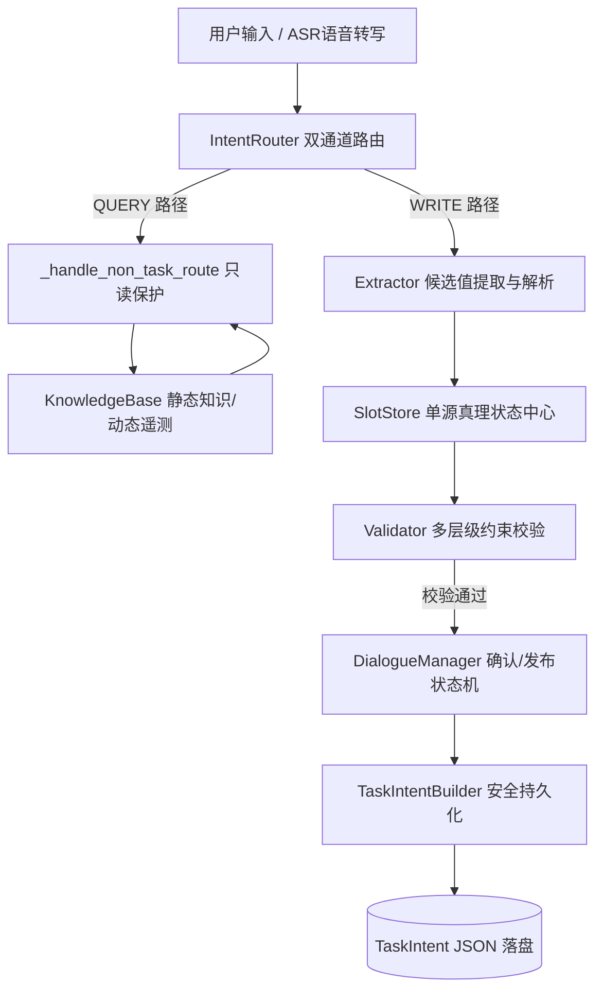
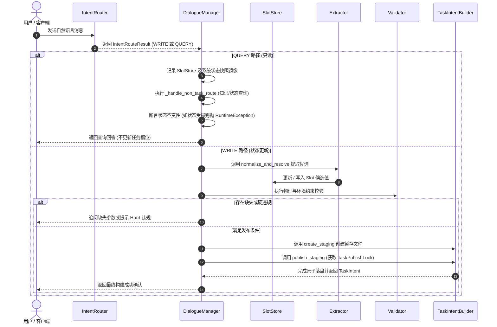
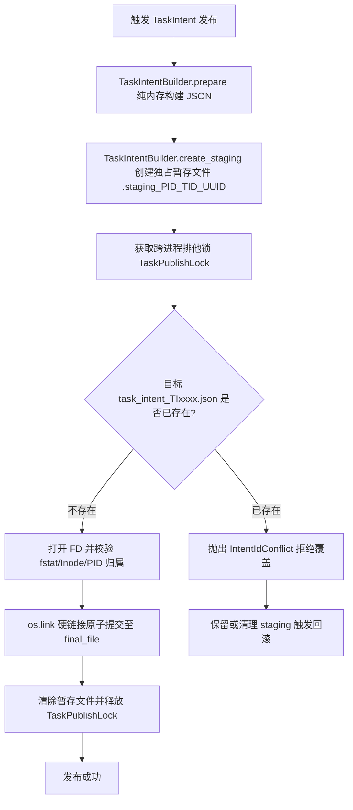

# 系统架构总览 (System Architecture Overview)

本文档阐述 SEAgent 深海多 Agent 任务规划与 ASR 交互系统的整体架构设计、模块协同机制、控制/数据流向以及核心系统契约与不变量。

---

## 1. 系统目标

SEAgent 旨在为深海水下机器人作业（包含巡检、清洗、阀门操作、故障排查等）提供强约束、多模态（语音与文本）、高可信的对话交互与 TaskIntent 任务构建能力。系统需在复杂海况、物理物理限制（水深、载荷、机械臂能力）与实时遥测状态下，确保任务参数的完整性、一致性与落盘安全性。

---

## 2. 模块架构与关系

系统由前端/ASR 接口层、意图路由层、抽取与状态管理层、知识与约束校验层以及持久化发布层构成。

### 核心模块职责映射

| 模块 | 关键类 / 文件 | 主要职责 |
| :--- | :--- | :--- |
| **ASR 服务与纠错** | [src/asr_service.py](file:///root/mzy/seagent1.0-main_asr/src/asr_service.py) [src/asr_normalizer.py](file:///root/mzy/seagent1.0-main_asr/src/asr_normalizer.py) [src/oilfield_linker.py](file:///root/mzy/seagent1.0-main_asr/src/oilfield_linker.py) | 语音转转文本、ASR 候选词+上下文纠错、油田实体 Link 评分与标准化。 |
| **意图路由器** | [src/intent_router.py](file:///root/mzy/seagent1.0-main_asr/src/intent_router.py) `IntentRouter`, `IntentRouteResult` | 将输入严格划分为 `WRITE`（写任务状态）或 `QUERY`（读知识与状态）。 |
| **对话状态管理** | [src/dialogue_manager.py](file:///root/mzy/seagent1.0-main_asr/src/dialogue_manager.py) `DialogueManager` | 主控状态机，调度路由、只读保护、追问生成与确认发布流程。 |
| **候选提取与解析** | [src/extractor.py](file:///root/mzy/seagent1.0-main_asr/src/extractor.py) `Extractor` | 提取参数候选，采用 `canonical_exact` -> `alias_exact` -> `llm_semantic` 递进解析。 |
| **状态中心** | [src/slot_store.py](file:///root/mzy/seagent1.0-main_asr/src/slot_store.py) `SlotStore`, `Slot` | Single Source of Truth，管理所有任务槽位状态、版本自增与事务管理。 |
| **知识与遥测** | [src/knowledge_retriever.py](file:///root/mzy/seagent1.0-main_asr/src/knowledge_retriever.py) [src/state_info.py](file:///root/mzy/seagent1.0-main_asr/src/state_info.py) | 提供设备静态能力查询，并读取 `config/state.yaml` 中的实时遥测状态。 |
| **物理约束校验** | [src/validator.py](file:///root/mzy/seagent1.0-main_asr/src/validator.py) `TaskValidator` | 执行水深、载荷、海况、时间有效性及机器人物理约束 Hard/Soft 校验。 |
| **TaskIntent 持久化** | [src/task_intent_builder.py](file:///root/mzy/seagent1.0-main_asr/src/task_intent_builder.py) `TaskIntentBuilder`, `TaskPublishLock` | Staging 暂存、排他锁控制与 `_atomic_commit_noreplace` 无覆盖原子落盘。 |

---

## 3. 控制流与状态流

系统交互分为 QUERY（查询）和 WRITE（写入）两条互斥的路径。

---

## 4. 关键边界与系统不变量

为确保系统运行的确定性与数据安全，系统设计中明确并强制执行以下边界与不变量：

> [!IMPORTANT]
> **1. QUERY 路径只读隔离**
> - `QUERY` 路由路径下**绝对不允许修改** `SlotStore` 中的任何槽位状态或对话阶段（Phase）。
> - [src/dialogue_manager.py](file:///root/mzy/seagent1.0-main_asr/src/dialogue_manager.py) 的 `_handle_non_task_route` 在处理前会捕获全量快照，并在处理后进行强制一致性断言。

> [!IMPORTANT]
> **2. WRITE 路径为唯一槽位修改入口**
> - 仅当 `IntentRouter` 判断为 `WRITE` 路由时，用户输入才允许送入 [src/extractor.py](file:///root/mzy/seagent1.0-main_asr/src/extractor.py) 进行提炼，并更新 [src/slot_store.py](file:///root/mzy/seagent1.0-main_asr/src/slot_store.py) 中的 `Slot` 状态。

> [!IMPORTANT]
> **3. SlotStore 作为 Single Source of Truth**
> - 系统中所有任务导出的 JSON 结构及下游校验输入，必须直接从 [src/slot_store.py](file:///root/mzy/seagent1.0-main_asr/src/slot_store.py) 导出 (`get_task_state`)，禁止绕过 `SlotStore` 直接使用临时上下文拼装任务状态。

> [!WARNING]
> **4. 动态机器人遥测状态隔离**
> - 机器人的实时状态（如电池残量、推进器健康度、故障标志）必须通过 [src/state_info.py](file:///root/mzy/seagent1.0-main_asr/src/state_info.py) 动态查询 `config/state.yaml` 或底层遥测接口获取。**不得使用历史对话记忆替代实时遥测数据**。

> [!CAUTION]
> **5. TaskIntent 文件原子持久化概念澄清**
> - [src/task_intent_builder.py](file:///root/mzy/seagent1.0-main_asr/src/task_intent_builder.py) 中提供的“原子持久化”（`_atomic_commit_noreplace` + `TaskPublishLock`）指 **TaskIntent JSON 文件在文件系统上的原子落盘与无覆盖安全保障**（即文件要么完整生成，要么不生成，杜绝中间态与覆盖风险）。
> - 该概念**绝非** Task Graph 任务拆解中的“不可分割原子任务 (Atomic Task)”概念，二者在架构上位于不同层级。

---

## 5. TaskIntent 安全发布工作流

TaskIntent 的文件落盘采用严格的三阶段发布机制，确保并发写操作安全与防篡改：

