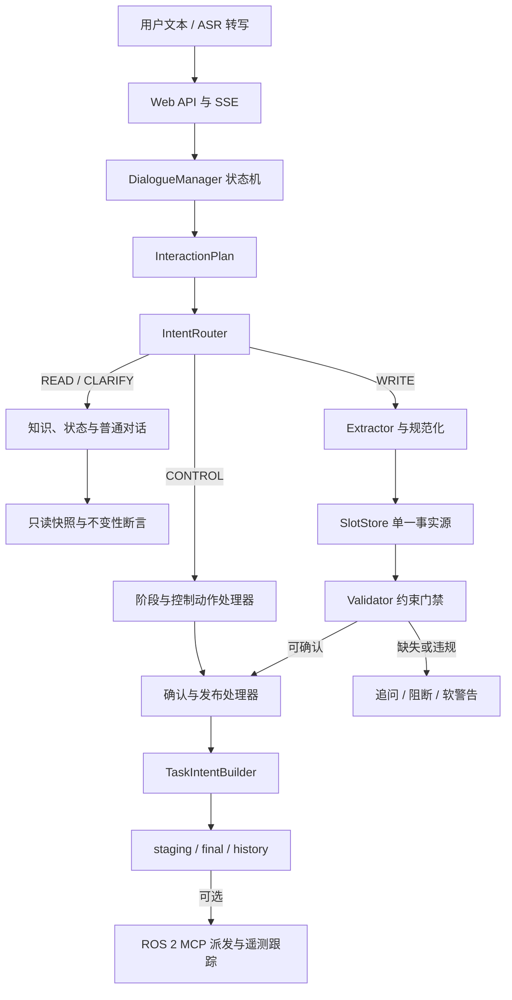

# 系统架构总览

本文档描述 SEAgent 当前的运行架构和边界，基准日期为 2026-09-30。实现状态以代码、测试和运行配置为准；本页不替代 ADR、执行下发契约或历史验收报告。

## 1. 系统范围

SEAgent 接收文本或 ASR 转写结果，将用户请求路由为普通对话、知识查询、任务参数写入或控制操作。任务路径收集并规范化槽位，执行环境、设备和遥测约束校验，在用户确认后生成不可覆盖的 TaskIntent 文件；可选的 ROS 2 MCP 桥接器负责后续派发和状态跟踪。

当前 `config/task_schemas.yaml` 中的任务模板为：

- 管缆巡检（`pipeline_inspection`）；
- 管缆埋设（`pipeline_burial`）；
- 采油树控制面板阀门操作（`tree_valve_operation`，包含插入和拔出动作）。

Task Graph、多机器人分配、动态重规划和通用 Robot Gateway 仍属于规划能力。现有 ROS 2 MCP 桥接器是可选的执行集成，不代表这些规划能力已经实现。

## 2. 运行架构


```mermaid
flowchart TD
    User[用户文本 / ASR 转写] --> API[Web API 与 SSE]
    API --> DM[DialogueManager 状态机]
    DM --> Plan[InteractionPlan]
    Plan --> Router[IntentRouter]

    Router -->|READ / CLARIFY| Query[知识、状态与普通对话]
    Query --> ReadGuard[只读快照与不变性断言]

    Router -->|WRITE| Extract[Extractor 与规范化]
    Router -->|CONTROL| Control[阶段与控制动作处理器]
    Control --> Commit
    Extract --> Store[SlotStore 单一事实源]
    Store --> Validate[Validator 约束门禁]
    Validate -->|缺失或违规| Reply[追问 / 阻断 / 软警告]
    Validate -->|可确认| Commit[确认与发布处理器]
    Commit --> Builder[TaskIntentBuilder]
    Builder --> Files[staging / final / history]

    Files -->|可选| Dispatch[ROS 2 MCP 派发与遥测跟踪]
```

### 2.1 入口与模块职责

| 层 | 主要模块 | 当前职责 | 状态 |
| --- | --- | --- | --- |
| Web/API | `src/web/`, `web_backend.py` | 聊天、SSE、ASR、时间、历史、MCP 和设备控制接口 | 已实现 |
| 会话与路由 | `src/dialogue_manager.py`, `src/session/` | 会话生命周期、InteractionPlan、普通对话与任务路径分流 | 已实现；部分 v2 功能受开关控制 |
| 抽取与规范化 | `src/extraction/`, `src/handlers/slot_extraction_pipeline.py` | 任务类型、字段、时间、坐标、设备和载荷候选处理 | 已实现 |
| 状态中心 | `src/slots/` | SlotStore、候选值、字段补丁、快照和列表槽位事务 | 已实现 |
| 知识与约束 | `src/knowledge/`, `src/validation/`, `src/state_info.py` | 项目事实、设备候选域、环境、遥测和硬/软约束 | 已实现 |
| 持久化 | `src/dispatch/task_intent_builder.py`, `src/session/history_manager.py` | TaskIntent 原子归档、历史快照、回滚和不确定提交恢复 | 已实现 |
| 执行集成 | `mcp/ros-mcp/core/`, `src/dispatch/task_dispatch.py` | 可选 ROS 2 WebSocket/MCP 桥接、任务状态和发送结果 | 已实现，需运行配置和桥接端 |
| 规划扩展 | Task Graph、多机器人分配、动态重规划、通用 Robot Gateway | 未来执行编排能力 | 规划中 |

### 2.2 功能开关

`config/features.yaml` 中的 `model_profiles_v2`、`normalization_contract_v2`、`session_state_v2` 等开关默认关闭。对应模块已经存在并被主流程引用，但 v2 契约只有在开关打开或显式测试时生效；文档不得将其描述为完全启用。

## 3. 路由和状态不变量

### 3.1 查询路径

- `READ` 和 `CLARIFY` 路径不得修改 SlotStore、任务槽位、任务阶段或版本号。
- 查询可以读取当前任务上下文，但不得将知识问答结果写入任务字段。
- 查询处理前后执行快照一致性检查；检查失败时返回错误而不是静默继续。

### 3.2 写入路径

- `WRITE` 路径负责候选抽取与字段更新；`CONTROL` 由阶段处理器执行确认、取消、警告确认等动作，不要求每个控制操作经过抽取器。
- InteractionPlan 的 `operation` 是路由计划字段；协议非法或 WRITE / CONTROL 置信度不足时进入澄清，合法低置信度 READ 仍可只读回答。当前 Router 对特定候选选择和任务启动表达保留 READ / CLARIFY 到 WRITE 的修正，见 [ADR-005 实现状态](../decisions/ADR-005-llm-semantic-authority.md)。
- 字段写入经过允许值、来源和规范化检查；Validator 对已收集任务执行业务约束校验，违规任务保留可修正的上下文并阻断确认或发布。
- 硬约束阻断不能通过“确认”“继续”或“忽略警告”绕过；软约束只能由明确的忽略动作继续。

### 3.3 终态会话

`done` 和 `rejected` 任务的任务字段保持只读，但会话仍可接收普通对话和只读查询；后续 WRITE 可沿事务创建新草稿，不能覆盖已发布文件。前端状态由 `src/session/ui_state_builder.py` 统一构建，相关行为由 `tests/test_issue_31_ui_state_contract.py` 覆盖。

## 4. 约束与遥测

约束来源包括：

- `config/constraints.yaml`：规则、严重级别和阈值；
- `config/oilfield.yaml`：油田、禁入区、海床和 DVL 风险区域；
- `config/robot_fleet.yaml`：设备层级、能力和物理上限；
- `config/state.yaml` 或底层遥测：机器人运行状态和更新时间。

候选机器人域由 `KnowledgeBase.get_feasible_robot_selection_domain()` 统一计算。当前入口按任务 `required_capabilities` 筛选系列，再组装 Class → Family → Variant → Unit 层级；它不按水深、载荷或海床条件剔除和排序型号，返回的 `rejected_variants` 为空。默认 `purpose="interactive"` 不用当前忙闲状态过滤候选；非交互用途且任务开始时间位于未来 0～60 分钟时，才额外过滤不可用 Unit，并以 `has_available_units` 标记型号。候选域不等于完整的任务可执行性结论，物理和环境约束仍需 Validator 检查。

交互收集阶段允许延后遥测检查。默认立即任务判定窗口为未来 60 分钟，并包含正在执行的任务；未来计划可延后动态状态校验。`purpose="runtime_execution"` 在派发前强制执行最新设备与环境检查，未来归档不表示已取得执行许可。

当前时效规则需分别理解：

| 检查 | 当前值与含义 | 来源 |
| --- | --- | --- |
| C019 | 超过 1800 秒产生软警告 | `config/constraints.yaml`、`TelemetryGate.check_rule` |
| 候选域运行可用性 | `StateInfo.check_runtime_availability` 默认 1800 秒；过期单机不可用 | `src/state_info.py`、`src/knowledge/selection_engine.py` |
| 知识库可用性查询 | `KnowledgeBase.check_runtime_availability` 默认传入 600 秒，可由调用者覆盖 | `src/knowledge_retriever.py` |
| 未来时间偏斜 | 遥测时间超前系统时间超过 300 秒视为非法 | `src/state_info.py`、`src/validation/telemetry_gate.py` |

这些检查不是统一的“24 小时快照窗口”。历史记录中的阈值不可直接用于当前运行判断。

## 5. TaskIntent 发布

发布过程如下：

1. 在内存中构建并校验 TaskIntent；
2. 在任务目录创建独占临时文件；
3. 获取 `TaskPublishLock`；
4. 校验并认领 staging，再从内存 intent 写入私有临时文件，回读核对内容；
5. 使用 `os.link` 将该私有临时文件以 no-overwrite 方式提交为正式文件；
6. 对正式文件和父目录执行必要的 `fsync`；
7. 清理可证明属于本次提交的临时文件并记录历史。

正式目录由 `SEAGENT_TASK_DIR` 或 `SEAGENT_RESULT_DIR` 决定；未设置时使用生产默认目录，在默认目录不可写时回退到仓库 `result/` 目录。流程不使用 symlink 覆盖正式文件。

若正式文件尚未生成即发生错误，系统回滚内存事务并保留必要证据。若正式文件已经生成但后续持久化确认失败，系统返回不确定提交状态，保留原任务编号，等待再次核对，不重复发布或覆盖文件。详细契约见 [execution_dispatch_contract.md](../execution_dispatch_contract.md)。

## 6. ROS 2 MCP 边界

`mcp/ros-mcp/` 提供可选的 ROS 2 桥接、协议转换、遥测订阅和任务状态跟踪。`src/dispatch/task_dispatch.py` 统一处理 Web 自动派发、`POST /api/mcp/dispatch` 和对话结果派发。

任务归档不等于机器人已经执行：

- `SCHEDULED`：任务已保存但未到计划时间；
- `SENT`：已有发送或接收证据；
- `UNKNOWN`：发送结果尚未确认；
- `FAILED`：校验异常、桥接离线或可确定尚未发送的错误；
- `BLOCKED`：执行前校验未通过。

真实机器人、Copernicus 海流服务和第三方 ROS 对比测试都需要额外运行环境，默认回归测试使用 mock/synthetic 数据。

未来任务没有后台自动调度，到期后需要显式检查并下发。阀门拔出计划可归档，但当前协议不支持该动作，派发返回 `BLOCKED`。归档、传输接收和机器人执行完成是不同状态。

## 7. 验证入口

```bash
python -m compileall -q src tests mcp/ros-mcp mcp/operation-time-window
TRANSFORMERS_OFFLINE=1 HF_HUB_OFFLINE=1 python -m pytest -q
```

真实模型、ASR 和 Chrome 流程由 `.github/workflows/real-e2e.yml` 及 `tests/run_*.py` 独立执行，不应与普通离线 CI 的结果混为一谈。
