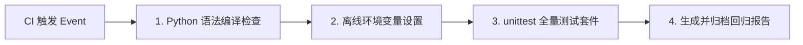

# 开发与测试指南 (Development & Testing Guide)

本文档提供 SEAgent 系统开发环境搭建、依赖区别、单元测试与全量回归测试命令、CI 对应的测试阶段以及测试排错指南。

---

## 1. Python 环境与依赖配置

系统推荐在 Python 3.10+ 环境下运行。项目在依赖设计上明确区分了 **CPU 测试环境** 与 **GPU ASR 运行环境**。

### 1.1 依赖安装区分

| 环境类型 | 适用场景 | 依赖配置文件 | 安装命令 |
| :--- | :--- | :--- | :--- |
| **CPU 测试依赖** | 本地单元测试、回归测试、CI 运行 | [requirements/test.txt](file:///root/mzy/seagent1.0-main_asr/requirements/test.txt) | `pip install -r requirements/test.txt` |
| **基础运行依赖** | 系统核心推理与对话服务 | [requirements/base.txt](file:///root/mzy/seagent1.0-main_asr/requirements/base.txt) | `pip install -r requirements/base.txt` |
| **GPU ASR 依赖** | 本地加载 Qwen ASR 语音模型运行 | [requirements/gpu.txt](file:///root/mzy/seagent1.0-main_asr/requirements/gpu.txt) | `pip install -r requirements/gpu.txt` |

---

## 2. 代码编译与测试命令

所有测试命令均基于仓库真实代码配置，可直接在项目根目录下执行。

### 2.1 Python 语法与编译检查

在运行单元测试前，首先使用 `compileall` 检查所有 `src/` 和 `tests/` 文件的 Python 语法正确性：

```bash
python -m compileall -q src tests
```

### 2.2 核心单元测试

运行项目全量单元测试与集成测试套件：

```bash
python -m unittest discover tests
```

如果需要查看更加详细的每个测试用例执行日志，可以加上 `-v` 参数：

```bash
python -m unittest discover tests -v
```

### 2.3 常用单测试模块运行

如果开发过程中只需要针对特定子模块进行调试，可直接指定模块文件：

- 意图路由测试：
  ```bash
  python -m unittest tests/test_intent_routing.py
  ```
- SlotStore 状态测试：
  ```bash
  python -m unittest tests/test_slot_consistency.py
  ```
- TaskIntent 原子发布测试：
  ```bash
  python -m unittest tests/test_phase1_atomic_publish_final_closeout.py
  ```
- ASR 规范化测试：
  ```bash
  python -m unittest tests/test_asr_normalizer.py
  ```

---

## 3. GitHub Actions CI 测试阶段

系统的 CI 流水线配置文件位于 [.github/workflows/tests.yml](file:///root/mzy/seagent1.0-main_asr/.github/workflows/tests.yml)，在代码 `push` 或提交 `pull_request` 时自动触发。

### 3.1 CI 阶段与本地命令对照表



| CI 阶段步骤 | CI 执行命令 | 本地等效验证命令 |
| :--- | :--- | :--- |
| **语法编译检查** | `python -m compileall -q src tests` | `python -m compileall -q src tests` |
| **环境与离线设置** | `export TRANSFORMERS_OFFLINE=1 HF_HUB_OFFLINE=1` | `export TRANSFORMERS_OFFLINE=1 HF_HUB_OFFLINE=1` |
| **全量回归测试** | `python -m unittest discover tests -v` | `python -m unittest discover tests -v` |
| **测试报告解析** | `python scratch/parse_tests.py` | `python scratch/parse_tests.py` |

---

## 4. 测试新增与命名规范

### 4.1 测试文件命名规范
- 新增单元测试必须存放在 `tests/` 目录下。
- 测试文件名必须以 `test_` 开头，例如 `tests/test_new_feature.py`。
- 测试类需继承自 `unittest.TestCase`，测试方法须以 `test_` 开头。

### 4.2 回归测试与边界闭环命名
对于阶段性 P0/P1 问题修复与边界闭环，推荐遵循既有命名模式：
- `tests/test_p0_<feature>_closeout.py`
- `tests/test_phase1_<feature>_final_closeout.py`

---

## 5. 测试失败排查与中间产物处理

### 5.1 排查方式
1. **优先查看完整 Traceback**：单元测试失败时，避免仅根据 Assertion 报错诊断，应结合终端日志查看完整的异常调用栈。
2. **检查输出日志**：CI 运行会保留并上传 `full_test.log` 和 `docs/regression_report.md`，可作为审计对比。

### 5.2 运行输出与持久化路径处理
测试运行过程中生成的中间文件与任务 Intent 输出目录通过 [src/result_paths.py](file:///root/mzy/seagent1.0-main_asr/src/result_paths.py) 统一管理：
- 系统优先读取环境变量 `SEAGENT_RESULT_DIR` 指定的输出路径。
- 在无环境变量指定时，默认使用系统临时安全目录，防止在 CI 或测试机环境产生写权限异常 (`PermissionError`)。
- 在测试用例的 `tearDown` 方法中，务必显式清理测试生成的临时 staging 或 intent 文件。
