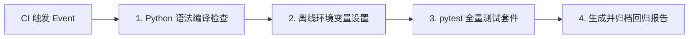

# 开发与测试指南 (Development & Testing Guide)

本文档提供 SEAgent 系统开发环境搭建、依赖区别、单元测试与全量回归测试命令、CI 对应的测试阶段以及测试排错指南。

---

## 1. Python 环境与依赖配置

系统推荐在 Python 3.10+ 环境下运行。项目在依赖设计上明确区分了 **CPU 测试环境** 与 **GPU ASR 运行环境**。

### 1.1 依赖安装区分

| 环境类型 | 适用场景 | 依赖配置文件 | 安装命令 |
| :--- | :--- | :--- | :--- |
| **CPU 测试依赖** | 本地单元测试、回归测试、CI 运行 | [requirements/test.txt](file:///root/mzy/seagent1.0-main_asr/requirements/test.txt) | `pip install -r requirements/test.txt` |
| **基础运行依赖** | 系统核心推理与对话服务 | [requirements/base.txt](file:///root/mzy/seagent1.0-main_asr/requirements/base.txt) | `pip install -r requirements/base.txt` |
| **GPU ASR 依赖** | 本地加载 Qwen ASR 语音模型运行 | [requirements/gpu.txt](file:///root/mzy/seagent1.0-main_asr/requirements/gpu.txt) | `pip install -r requirements/gpu.txt` |

---

## 2. 代码编译与测试命令

所有测试命令均基于仓库真实代码配置，可直接在项目根目录下执行。

### 2.1 Python 语法与编译检查

在运行单元测试前，使用 `compileall` 检查核心代码和两个 MCP 子项目的 Python 语法：

```bash
python -m compileall -q src tests mcp/ros-mcp mcp/operation-time-window
```

### 2.2 核心单元测试

运行项目全量单元测试与集成测试套件。pytest 会在收集测试模块前自动创建与用户
运行目录分离的一次性 result/task/history 目录：

```bash
TRANSFORMERS_OFFLINE=1 HF_HUB_OFFLINE=1 python -m pytest -q
```

如果需要查看更加详细的每个测试用例执行日志，可以加上 `-v` 参数：

```bash
TRANSFORMERS_OFFLINE=1 HF_HUB_OFFLINE=1 python -m pytest -v
```

默认 pytest 收集 `tests/`、`mcp/ros-mcp/tests/`、
`mcp/operation-time-window/tests_unit/` 和 `mcp/operation-time-window/tests_mcp/`。
`requirements/test.txt` 包含海流服务及异步测试依赖。前端回归还需要 Node.js；CI 使用 Node.js 20。
本地 MCP 兼容层使用 SDK 1.x，依赖限定为 `mcp>=1.27,<2`、`fastmcp>=2,<4`；
升级到 MCP SDK 2.x 前需同步适配导出符号并运行协议回归。
CI 使用同一入口并保存原生 JUnit 报告：

```bash
TRANSFORMERS_OFFLINE=1 HF_HUB_OFFLINE=1 python -m pytest -q --junitxml=pytest-results.xml
```

默认测试使用本地 mock/synthetic 数据，不访问真实海流服务。真实 Copernicus 测试需安装
海流子项目的 `copernicus` 可选依赖、配置服务凭据，并设置 `RUN_COPERNICUS_LIVE_TEST=1`：

```bash
RUN_COPERNICUS_LIVE_TEST=1 python -m pytest -q mcp/operation-time-window/tests_mcp/test_live_copernicus.py
```

`outside/` 中的第三方 ROS 库未纳入版本控制。其比较测试默认跳过；准备好这些源码和依赖后，
可设置 `SEAGENT_RUN_EXTERNAL_COMPARISON=1` 运行。仓库自身的适配器和模拟下发测试始终默认运行。

### 2.3 常用单测试模块运行

如果开发过程中只需要针对特定子模块进行调试，可直接通过 `pytest` 指定模块文件：

- 意图路由测试：
  ```bash
  pytest tests/test_intent_routing_matrix.py -v
  ```
- SlotStore 状态测试：
  ```bash
  pytest tests/test_slot_consistency.py -v
  ```
- TaskIntent 原子发布测试：
  ```bash
  pytest tests/test_phase1_atomic_publish_final_closeout.py -v
  ```
- ASR 规范化测试：
  ```bash
  pytest tests/test_asr_normalizer.py -v
  ```
- 领域子包按需加载测试：
  ```bash
  pytest tests/test_package_imports.py -v
  ```

---

## 3. GitHub Actions CI 测试阶段

系统的 CI 流水线配置文件位于 [.github/workflows/tests.yml](file:///root/mzy/seagent1.0-main_asr/.github/workflows/tests.yml)，在代码 `push` 或提交 `pull_request` 时自动触发。

### 3.1 CI 阶段与本地命令对照表



| CI 阶段步骤 | CI 执行命令 | 本地等效验证命令 |
| :--- | :--- | :--- |
| **语法编译检查** | `python -m compileall -q src tests mcp/ros-mcp mcp/operation-time-window` | 同 CI 命令 |
| **环境与离线设置** | `export TRANSFORMERS_OFFLINE=1 HF_HUB_OFFLINE=1` | `export TRANSFORMERS_OFFLINE=1 HF_HUB_OFFLINE=1` |
| **全量回归测试** | `python -m pytest -q --junitxml=pytest-results.xml` | `python -m pytest -q` |
| **测试报告** | 上传 `pytest-results.xml` 和 `full_test.log` | 可添加 `--junitxml=pytest-results.xml` |

---

## 4. 测试新增与命名规范

### 4.1 测试文件命名规范
- 核心单元测试存放在 `tests/`，MCP 测试存放在对应子项目的测试目录下。
- 测试文件名必须以 `test_` 开头，例如 `tests/test_new_feature.py`。
- 测试类需继承自 `unittest.TestCase`，测试方法须以 `test_` 开头。

### 4.2 回归测试与边界闭环命名
对于阶段性 P0/P1 问题修复与边界闭环，推荐遵循既有命名模式：
- `tests/test_p0_<feature>_closeout.py`
- `tests/test_phase1_<feature>_final_closeout.py`

---

## 5. 测试失败排查与中间产物处理

### 5.1 排查方式
1. **优先查看完整 Traceback**：单元测试失败时，避免仅根据 Assertion 报错诊断，应结合终端日志查看完整的异常调用栈。
2. **检查输出日志**：CI 运行会保留并上传 `full_test.log` 和 `pytest-results.xml`，可作为审计对比。

### 5.2 运行输出与持久化路径处理
测试运行过程中生成的中间文件与任务 Intent 输出目录通过 [src/dispatch/result_paths.py](file:///root/mzy/seagent1.0-main_asr/src/dispatch/result_paths.py) 统一管理：
- 用户运行优先读取 `SEAGENT_RESULT_DIR`，未配置时使用 `/root/autodl-tmp/result`。
- pytest 和包级 unittest 在导入业务模块前统一覆盖 result/task/history 为测试专用目录。
- 子进程继承同一测试目录；未设置 `SEAGENT_TEST_RESULT_DIR` 时，测试结束自动清理。
- 需要保留测试产物时，可显式设置 `SEAGENT_TEST_RESULT_DIR`，不得指向用户运行目录。
