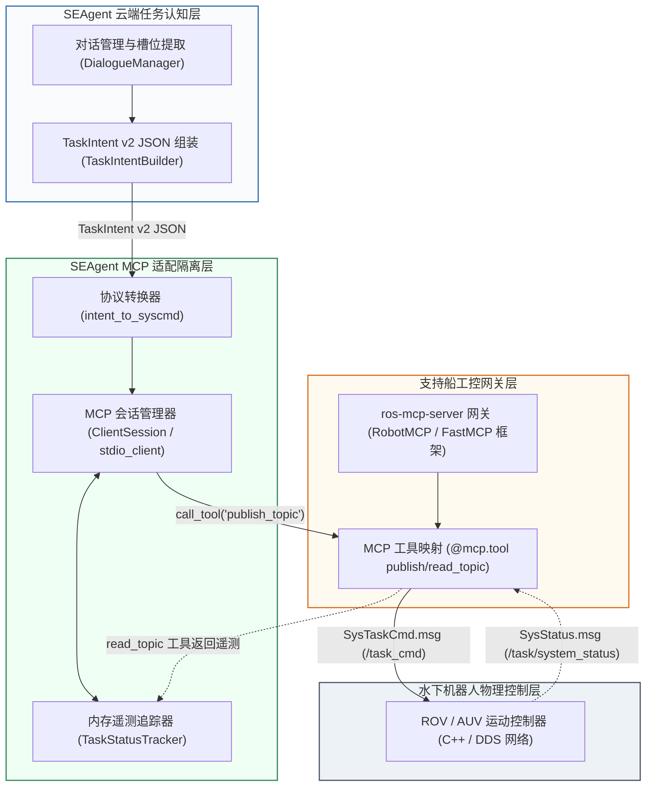
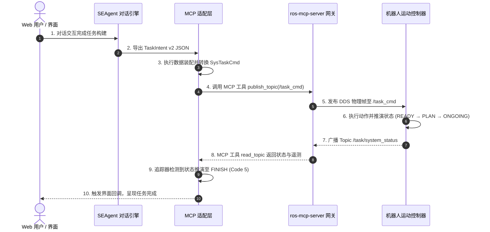

# SEAgent ROS 2 MCP 适配器架构设计汇报提纲

> [!NOTE]
> 本提纲旨在阐述 SEAgent 任务智能层与水下机器人 ROS 2 控制网关之间 `SeagentROS2MCPAdapter` 组件的设计逻辑、协议映射机制与双向通信闭环实现。

| 属性维度 | 详细说明 |
| :--- | :--- |
| **汇报主题** | SEAgent 与 ROS 2 MCP 双向通信适配器设计逻辑与实现 |
| **汇报团队** | SEAgent 研发小组 |
| **核心适配组件** | `SeagentROS2MCPAdapter` (`mcp/seagent_mcp_adapter.py`) |
| **底层协议规范** | Anthropic Model Context Protocol (MCP) / `ros-mcp-server` (RobotMCP 框架) |
| **目标工控系统** | 深海支持船 Topside 网关 / ROV & AUV 水下控制系统 |

---

## 1. 汇报摘要

本汇报阐述了 SEAgent 深海机器人任务智能系统中核心适配组件——`SeagentROS2MCPAdapter` 的架构设计与工程实现。

该适配器作为云端任务认知层与机器人控制网关之间的通信枢纽，严格遵循 Model Context Protocol (MCP) 标准规范。系统实现了自然语言任务 Schema 与工业级 DDS 消息契约（`SysTaskCmd.msg`）的高效解耦与双向映射，为管缆巡检、管缆埋设与采油树控制面板插拔三项典型深海作业提供了可靠的指令下发、遥测接收与生命周期推演能力。

---

## 2. 核心设计理念

### 2.1 架构挑战与痛点
- **异构 Schema 契约解耦**：SEAgent 认知层基于大语言模型构建，面向用户交互，维护多维度的 TaskIntent v2 JSON；而水下机器人控制网关依赖强类型、固定结构的 C++ 二进制控制帧。
- **生态标准规范对齐**：采用开放的 MCP 标准，将 ROS 2 话题收发抽象为规范的 Tool 函数（`publish_topic` / `read_topic`），消除对特定网络私有协议的硬性耦合。

### 2.2 核心设计原则
1. **分层分工原则**：认知层仅聚焦任务意图提炼，控制层仅聚焦动力学解算，适配层承担协议解析、坐标变换与数据装配。
2. **遥测快照隔离原则**：高频遥测数据（水深、距海底高度、控制模式）仅存留于内存快照（`TaskStatusTracker`），保障静态配置文件的持久化安全。
3. **Fail-Closed 保护原则**：下发指令默认装配 `fail_stop: true` 保护标志，支持对异常推演任务进行即时挂起或阻断。

---

## 3. 层次架构与组件职责

整体系统采用分层解耦拓扑结构，架构图如下：



---

## 4. 协议转换与数据装配逻辑

适配器通过 `intent_to_syscmd()` 函数将语义 JSON 转换为符合 7 字段契约的 `SysTaskCmd` 物理结构体：

```python
SysTaskCmd = {
    "task_type":  int,           # 映射后的 ROS 2 任务类型枚举 (1, 2, 4)
    "task_id":    int,           # 唯一自增任务 ID (0x80001)
    "frame_id":   "odom",        # 坐标参考系
    "priority":   15,            # 任务优先级
    "pos_target": List[Pose],    # 目标位姿数组 [x, y, z = -depth]
    "params":     List[float],   # 物理控制参数 [作业水深, 航速]
    "fail_stop":  True           # 应急断能标志
}
```

### 三种典型任务类型的映射规范

1. **管缆巡检任务 (`pipeline_inspection`)**：
   - **映射枚举**：`task_type = 2` (`SEARCH_CABLE`, 巡缆)。
   - **位姿装配**：提取巡检起始与结束坐标，装配为 `pos_target[0]`（起点位姿）与 `pos_target[1]`（终点位姿），深度转换为负值 $z = -h_{\text{water}}$。
   - **控制参数**：`params = [water_depth, speed_ms]`。

2. **管缆埋设任务 (`pipeline_burial`)**：
   - **映射枚举**：`task_type = 1` (`CLAMP_CABLE`, 夹缆/埋设)。
   - **位姿装配**：提取埋设起点坐标，装配为 `pos_target[0]`。
   - **控制参数**：`params = [water_depth, speed_ms]`。

3. **采油树控制面板插拔任务 (`tree_valve_operation`)**：
   - **映射枚举**：`task_type = 4` (`INSERT_PLUG`, 采油树插拔/阀门操作)。
   - **位姿装配**：提取井口/阀门插孔坐标，装配为 `pos_target[0]`。
   - **控制参数**：`params = [water_depth, speed_ms]`。

---

## 5. 双向闭环与状态推演机制

系统建立了完整的指令下发与状态反馈时序闭环，时序图如下：



---

## 6. 测试验证结论

在自动化测试套件（`mcp/test_public_libraries_comparison.py`）及完整集成测试中：

- **测试用例覆盖**：120 项用例全部执行通过（100% PASS）。
- **稳定性与鲁棒性**：协议转换正确，并发 ID 锁安全分配，异常中断后具备恢复能力。
- **验证结论**：`SeagentROS2MCPAdapter` 已完成测试验证，具备与机器人工控系统开展协同测试的工程条件。
