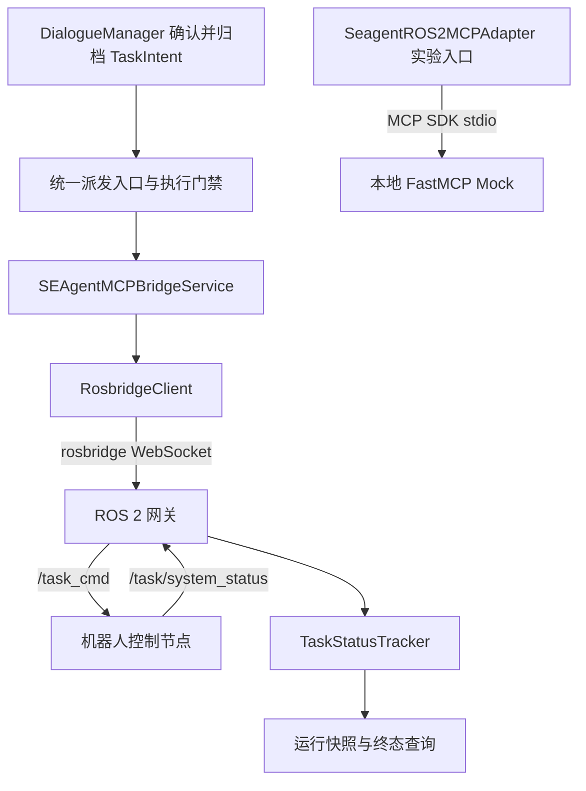
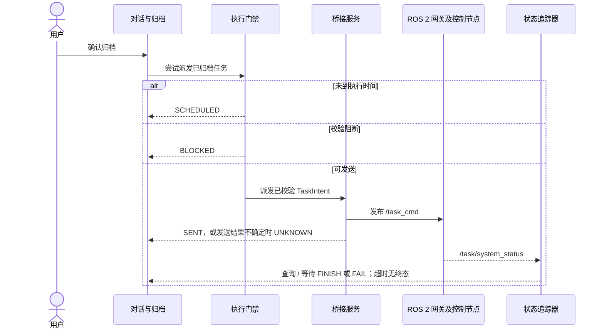

# SEAgent ROS 2 通信适配架构汇报提纲

> 2026-09-30 修订：正文按当前实现组织，历史统计单独保留。生产接口以 [MCP 模块说明](../README.md)与[执行下发契约](../../../docs/execution_dispatch_contract.md)为准。逐项协议勘误及配套 PDF 见[适配说明](adapter_specification_report.md)。

| 属性 | 内容 |
| --- | --- |
| 汇报主题 | SEAgent 对话任务归档、ROS 2 派发与机器人状态反馈 |
| 当前实现 | `SEAgentMCPBridgeService` / `RosbridgeClient` / `TaskStatusTracker` |
| 实验实现 | `SeagentROS2MCPAdapter` / 本地 FastMCP stdio Mock |
| 证据范围 | 当前源码与已有测试；历史仿真结果另列，未据此认定实机验收通过 |

## 1. 汇报摘要

SEAgent 将任务内容归档为 TaskIntent，再由执行门禁决定是否派发。生产链路经 rosbridge WebSocket 发布 `/task_cmd`，通过 `/task/system_status` 获取遥测和任务状态。任务归档、传输发送、机器人终态应分别展示。

本地 stdio 适配器用于 MCP 工具调用实验。其固定任务 ID、单目标位姿和旧式 `params` 与生产转换器存在差异，不能把 Mock 返回成功当作当前协议符合性证明。

## 2. 设计分工

- 对话层负责意图、槽位、约束和确认归档。
- 执行门禁负责时间窗口、执行前校验及已有发送记录核对。
- 桥接服务负责协议转换、连接与发送记录；`RosbridgeClient` 负责 WebSocket 收发。
- `TaskStatusTracker` 负责运行态遥测与任务状态；这些快照不写回静态设备配置。

`fail_stop` 是协议字段。不能仅凭设置此字段推断所有现场异常均能自动停机；管理命令还有独立的字段规则。

## 3. 当前运行拓扑



Python 集成需要显式调用 `dispatch_dialogue_result()`；`attach_mcp_bridge()` 只绑定引用。Web 对话在首次进入 `done` 时尝试派发。未来任务暂记为 `SCHEDULED`，当前没有自动到期调度器。

## 4. 协议映射要点

| 业务任务 | 枚举 | 位姿要求 | `frame_id` | `params` |
| --- | --- | --- | --- | --- |
| 管缆巡检 | `SEARCH_CABLE=2` | 起点、终点两个位姿 | 默认 `odom` | `[]` |
| 管缆埋设 | `CLAMP_CABLE=1` | 一个目标位姿 | `""` | `[]` |
| 采油树插入 | `INSERT_PLUG=4` | 一个目标位姿；明确插入动作 | `""` | `[]` |
| 采油树拔出 | 无对应枚举 | 可保存计划，不能下发 | 不生成 | 不生成 |

默认坐标兼容映射为 longitude→x、latitude→y、水深→负 z；局部地理投影必须显式启用并核对原点。上述三类任务不使用 `params=[水深, 航速]`。

任务管理使用 `/task_cmd` 上的 `TASK_MANAGE=0`，参数为动作枚举及必要的目标任务 ID，不存在本模块提供的 `/task_manage` 话题接口。系统配置使用 `/task/sys_config`。

## 5. 状态反馈与异常分支



`SENT` 映射的 `success` 是派发结果；`FINISH` 才表示成功终态，`FAIL` 表示失败终态。`UNKNOWN` 需要核对发送记录和机器人状态，不能直接重复发送。

## 6. 验证证据与演示边界

当前协议与对话集成测试入口：

```bash
python -m pytest -q \
  mcp/ros-mcp/tests/test_ros_group_protocol_contract.py \
  mcp/ros-mcp/tests/test_dialogue_mcp_integration.py
```

本次执行结果记录于[适配说明的验证章节](adapter_specification_report.md#5-验证记录与历史统计)。测试使用本地环境，不验证现场网络、真实机器人动作或坐标校准。

旧提纲曾引用“120 项通过”，来源为 2026-08-21 的[历史报告](mcp_execution_verification_report.md)。该数字仅描述当时记录，不代表当前套件数量。历史报告中的载荷、函数名及旧式 Topic 必须结合逐项勘误阅读；当前汇报不能沿用其“已具备实机工程条件”的结论。
