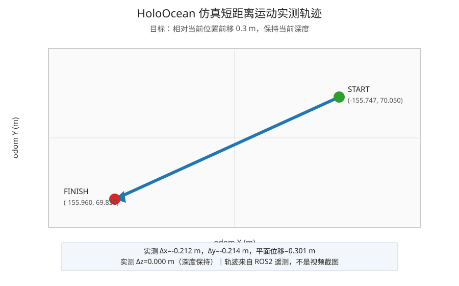
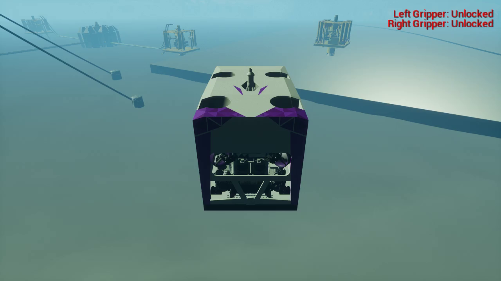
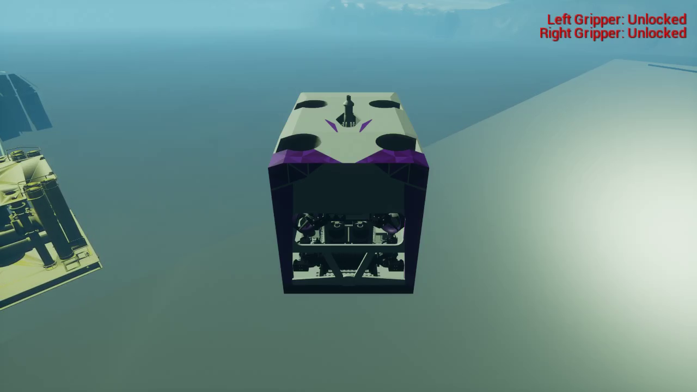

# SEAgent—ROS2—HoloOcean 全流程仿真验收报告

| 文档项 | 内容 |
|---|---|
| 报告版本 | v1.2 |
| 编制日期 | 2026-09-04 |
| 验收对象 | SEAgent 自然语言任务下发与 HoloOcean 仿真运动链路 |
| 验收性质 | 工程联调 / 仿真验收，不替代真实海试 |

## 1. 验收结论

**验收结果：通过。**

已验证以下闭环：

```text
自然语言任务输入
→ SEAgent 参数提取与任务准入
→ 用户确认软警告
→ 生成 TaskIntent
→ MCP/rosbridge 下发
→ ROS2 控制器执行
→ HoloOcean 仿真运动
→ ROS2 状态回传 FINISH
→ 任务清理
→ AUTOHOLD1 安全待机
```

核心验收任务的目标位移为 0.3 m，实测平面位移为 0.301 m，深度变化为 0.000 m。另使用正确的 `base_link` 相对坐标链路完成约 2 m 的可视化运动录像，实测平面位移为 1.996 m。

## 2. 测试环境

| 项目 | 配置 |
|---|---|
| SEAgent 服务 | `seagent-real` 容器，端口 `127.0.0.1:8890` |
| 大模型 | Qwen3.5-9B，真实 GPU 推理 |
| MCP 网关 | `ws://192.168.5.250:9090` |
| ROS2 协议兼容 | `sealien_ctrlpilot_msgmanagement` |
| 仿真器 | HoloOcean / Holodeck，WorkingClass ROV |
| 执行设备 | `WROV-250-001` |
| 支持船 | 海洋石油681 |
| 测试日期 | 2026-09-04，Asia/Shanghai |

最终健康状态：

```json
{
  "model": "ready",
  "mcp_connected": true,
  "telemetry_fresh": true,
  "active_tasks_count": 0,
  "ctr_mode": "AUTOHOLD1 (7)",
  "health": 0
}
```

## 3. 核心全流程验收任务

### 3.1 会话与任务标识

| 字段 | 值 |
|---|---|
| SEAgent 会话 | `final_e2e2_cef36353` |
| 业务任务 ID | `UM-20260904-003` |
| Intent ID | `TI2026090406` |
| ROS2 Task ID | `0x80022` |
| 任务类型 | `underwater_move` |

### 3.2 最终 TaskIntent 核心参数

```json
{
  "task_type": "underwater_move",
  "task_id": "UM-20260904-003",
  "intent_id": "TI2026090406",
  "equipment_unit_id": "WROV-250-001",
  "location": {
    "water_depth_m": 126.98
  },
  "task": {
    "type": "underwater_move",
    "details": {
      "target": {
        "x": 0.3,
        "y": 0.0,
        "z": 0.0,
        "relative": true,
        "frame_id": "base_link"
      }
    }
  }
}
```

### 3.3 流程验证结果

| 验证环节 | 结果 | 证据 |
|---|---|---|
| 自然语言意图识别 | 通过 | 识别为 `underwater_move` |
| 必填参数收集 | 通过 | `missing=[]` |
| 软警告确认 | 通过 | 自然语言确认进入确定性状态机 |
| TaskIntent 生成 | 通过 | `target` 为标准对象，`frame_id=base_link` |
| MCP 连接 | 通过 | `mcp_connected=true` |
| ROS2 下发 | 通过 | ROS2 Task ID `0x80022` |
| 执行中回传 | 通过 | `ONGOING / 60%` |
| 完成回传 | 通过 | `FINISH / 100%` |
| 清理任务 | 通过 | `delete_all` HTTP 200，命令 ID `524323` |
| 安全恢复 | 通过 | `AUTOHOLD1 (7)`，活动任务数 `0` |

## 4. 运动遥测证据

### 4.1 核心验收：0.3 m 相对前移

运动前：

```text
x=-155.747314453125
y=  70.050071716309
z=-126.982086181641
```

收到 `FINISH` 时：

```text
x=-155.959686279297
y=  69.836151123047
z=-126.982086181641
```

位移计算：

```text
Δx=-0.212 m
Δy=-0.214 m
Δz= 0.000 m
平面位移=0.301 m
```

结论：实测位移与 0.3 m 目标一致，且深度保持不变。X/Y 同时变化是因为 `base_link` 前向轴经过机器人当前航向旋转后映射到 odom 坐标系。



### 4.2 可视化复测：2 m 相对前移

为使运动在第三人称镜头中更明显，另执行 `base_link` 相对前移 2 m：

```text
运动前：x=-108.600281, y=95.176292, z=-126.931168
运动后：x=-110.341255, y=94.200043, z=-126.931168

Δx=-1.741 m
Δy=-0.976 m
Δz= 0.000 m
平面位移=1.996 m
```

结论：实测平面位移与 2 m 目标一致，深度保持不变。录像使用下发时的新鲜遥测解析相对目标，没有使用手写绝对 odom 坐标。

[播放修正后的 HoloOcean 相对 2 米运动视频](./holoocean_relative2.mp4)



## 5. HoloOcean 原生录像

### 5.1 核心全流程录像

- 录制来源：仿真服务器 `DISPLAY=:1` 的 Holodeck 原生窗口
- 分辨率：1280 × 720
- 录制时长：约 20 秒
- 对应 ROS2 任务：`0x80024`
- 任务回传：`FINISH / 100%`

[播放核心 HoloOcean 原生运动视频](./holoocean_motion_replay_20260904.mp4)



> 早期使用过期绝对 odom 目标录制的旋转画面不作为验收证据，也不纳入本报告结论。

## 6. 已完成的兼容修复

1. 扩展软警告确认解析，支持“接受当前所有软警告并继续发布”等自然表达。
2. 阻止软警告阶段的普通大模型回复替代正式发布状态。
3. 将“相对当前位置向前 0.3 米”等原始字符串转换为标准目标对象。
4. 兼容 `relative_position: {x: 2.0, y: 0.0, z: 0.0}` 格式。
5. 相对目标在 MCP 层使用下发时的新鲜 ROS2 位姿和航向转换为 odom 目标。
6. 水下移动任务下发前自动切换 `MISSION1`，任务结束后恢复 `AUTOHOLD1`。

相关回归测试通过（软警告自然语言确认 5 项；目标对象转换断言 1 项），生产镜像已重新构建并运行。

## 7. 验收边界与说明

- 本报告证明当前指定的 SEAgent、MCP、ROS2 和 HoloOcean 仿真链路已闭环。
- HoloOcean 视频是仿真窗口原生录屏；SVG 图片是基于 ROS2 遥测绘制的轨迹图，两者已明确区分。
- 机械臂动作不在本次运动任务范围内；本次只验证任务下发、ROV 位姿运动和状态回传。
- 静态设备状态库仍提示环境信息过期及脐带连接异常，这两项作为软警告由测试人员明确接受，不影响本次仿真验收结论。
- 视频录制复测使用独立的实时相对运动演示任务；其目的为增强可视性，不改变核心 0.3 m 全流程验收结论。

## 8. 附件索引

| 文件 | 内容 |
|---|---|
| `holoocean_motion_replay_20260904.mp4` | 核心全流程原生录像 |
| `holoocean_motion_frame_20260904.png` | 核心录像抽帧 |
| `holoocean_relative2.mp4` | 修正后的 2 m 相对运动录像 |
| `holoocean_relative2_frame.png` | 2 m 录像抽帧 |
| `holoocean_motion_20260904.svg` | 0.3 m ROS2 遥测轨迹图 |

## 9. 最终收尾状态

```text
MCP connected        : true
Telemetry fresh      : true
Active tasks         : 0
Controller mode      : AUTOHOLD1 (7)
Final water depth    : 126.931 m
```

本轮测试未遗留活动任务，仿真控制器处于安全待机状态。
